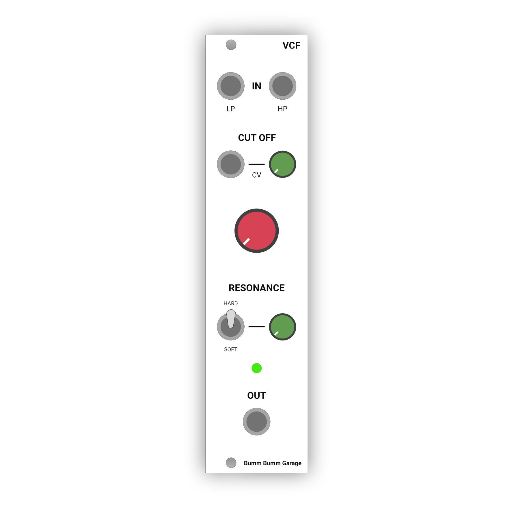
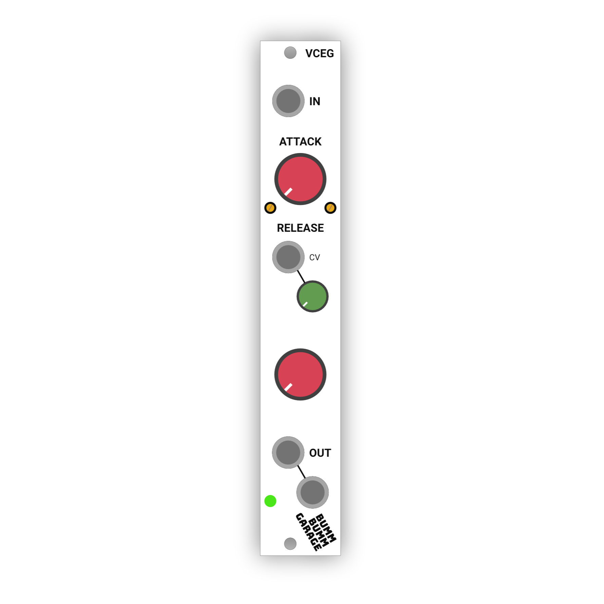
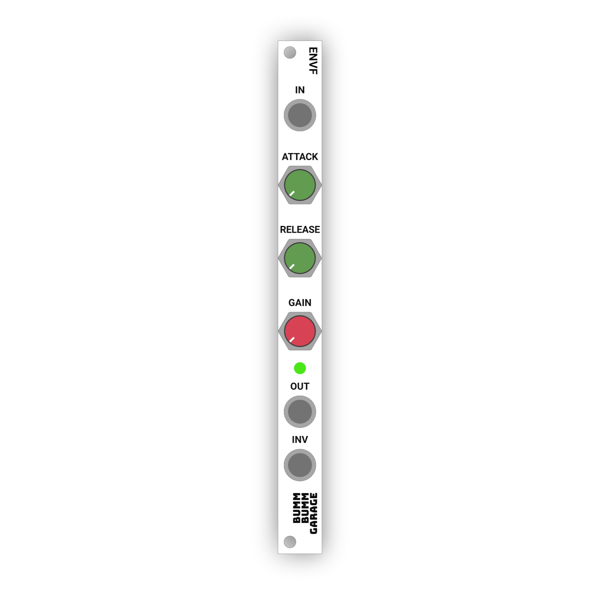
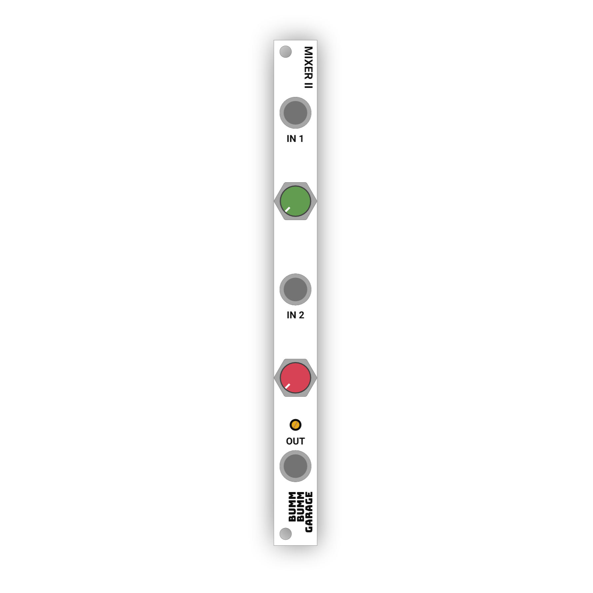
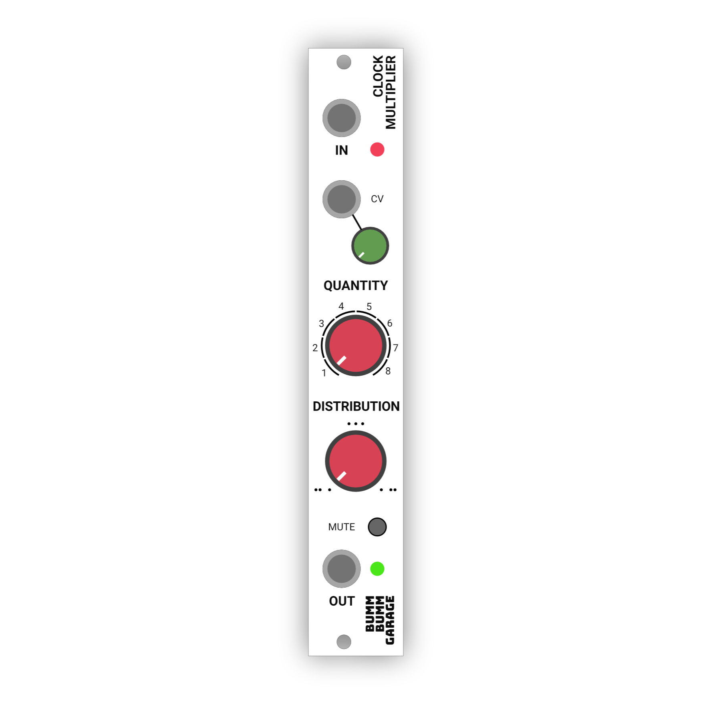

# One Module Per Month

Over a period of five months, I will release one module per month as a buyable DIY kit (through-hole).

**Update November 2022**: I walked through the project plan quite some weeks. At some point by the beginning of this year I realized that it causes more stress than fun. So I decided to drive the development as it fits ot my flow. Still all the modules are in progress and maybe somewhere in the futures they'll all be emitted 😌

**Contents**

1. [A Dream Come True](#a-dream-come-true)
2. [Roadmap (Modules)](#roadmap-modules)
3. [Simple DIY Kits](#simple-diy-kits)

## A Dream Come True

When I started DIY synth stuff in May 2020, I looked in deep admiration at the makers of modules and DIY kits 🤩 Nothing has been lost in the fascination. With the circuits and modules I built myself over time, I took bigger and bigger steps and was always grateful for the positive feedback! At the end of this year (2021), the opportunity has arisen to distribute my modules as DIY kits. Thanks to the great people at [Exploding Shed](https://www.exploding-shed.com/)! With this a little dream comes true for me 🦄

**Over a period of six months, I will release one module per month as a buyable DIY kit.** I haven't done anything like that yet. That's why I'm looking forward to the ideas, through the wins and fails that arise along the way 💪

From a big picture view I'm still iterating on my mobile techno rack. This is where the specific ideas for my modules come from, especially when these requirements are not yet served on the DIY kit market.

## Roadmap (Modules)

| Month       | Module                                                       |
| ----------- | ------------------------------------------------------------ |
| *May*       | **[Voltage Controlled Filter (VCF)](/modules/vcf) ** MS-20 style, based on ["Korg late MS20 filter" by René Schmitz](https://www.schmitzbits.de/ms20.html) (with friendly permission). |
| *June*      | **[Voltage Controlled Envelope Generator (VCEG)](/modules/voltage-controlled-envelope-generator-vceg/) ** On a [AS3310](https://www.alfarzpp.lv/eng/sc/AS3310.php) basis. |
| *July*      | **[Envelope Follower (ENVF)](/modules/envelope-follower/) ** Handy tool for sidechaining in 2hp. Built with simple analog technology. |
| *August*    | **[Utility Mixer](/modules/mixer-ii/) ** Two channel mixer for audio and CV in 2hp. Based on simple analog technology. |
| *September* | **[Clock Multiplier](/modules/clock-multiplier/) ** Based on an [ATMega328](https://en.wikipedia.org/wiki/ATmega328). |

## Simple DIY Kits

When designing modules, I consider the experience of my DIY journey over the last months. Having seen highest highs of euphoria and deepest valleys of demotivation, I know some pitfalls and try to keep my designs **as frustration-free as possible**.

I work with certain principles and constraints:

1. **Few different components** – I try to limit the values and types to few and simple. For example, I am very happy if the values of the resistors in a kit are limited to 1K, 10K, and 100K.
2. **Components that are always available** – I like to have all the components for a new kit already in my modest box. For example, that's why I like to use widely available op amps, like uA741 and TL072.
3. **Compact module design** – I don't want to break or change my case. I need modules with as much functionality as possible in a limited space.

<!--

## Become A Beta Tester

Each module will go through certain stages in its development:

1. Breadboard prototype, to test the circuit and function.
2. PCB & Panel Prototype, to get feedback on the module and documentation.
3. DIY Kit Release.

For the second stage, **I am looking for eager people to test one or more DIY kits** at the given time. At this stage I will ship the kits at cost (around 12 € for PCB, panel and shipping worldwide). You then have to source the components yourself and I would ask you for feedback within four weeks.

If you're generally interested, **[please send me your data to become a beta tester](become-a-beta-tester).**

-->
