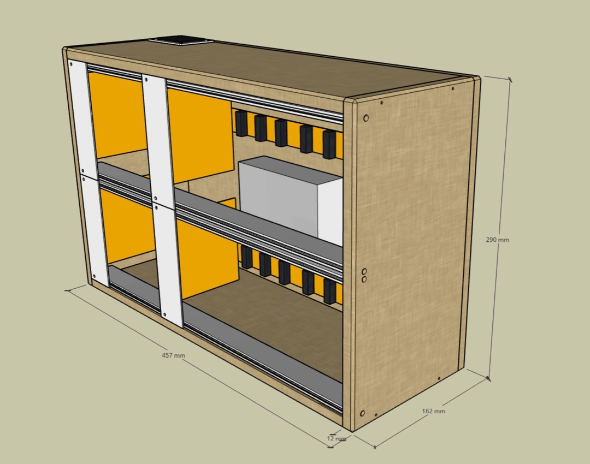
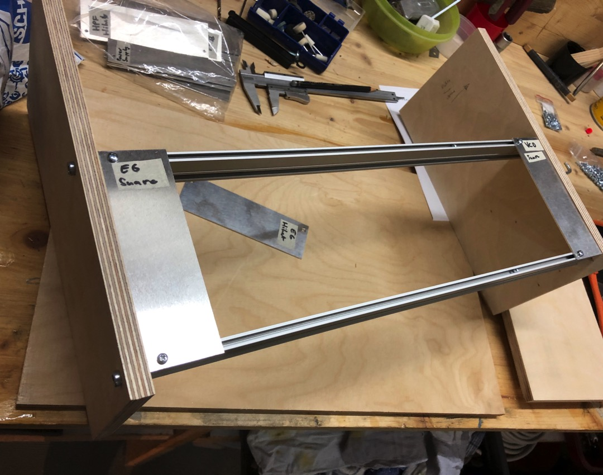
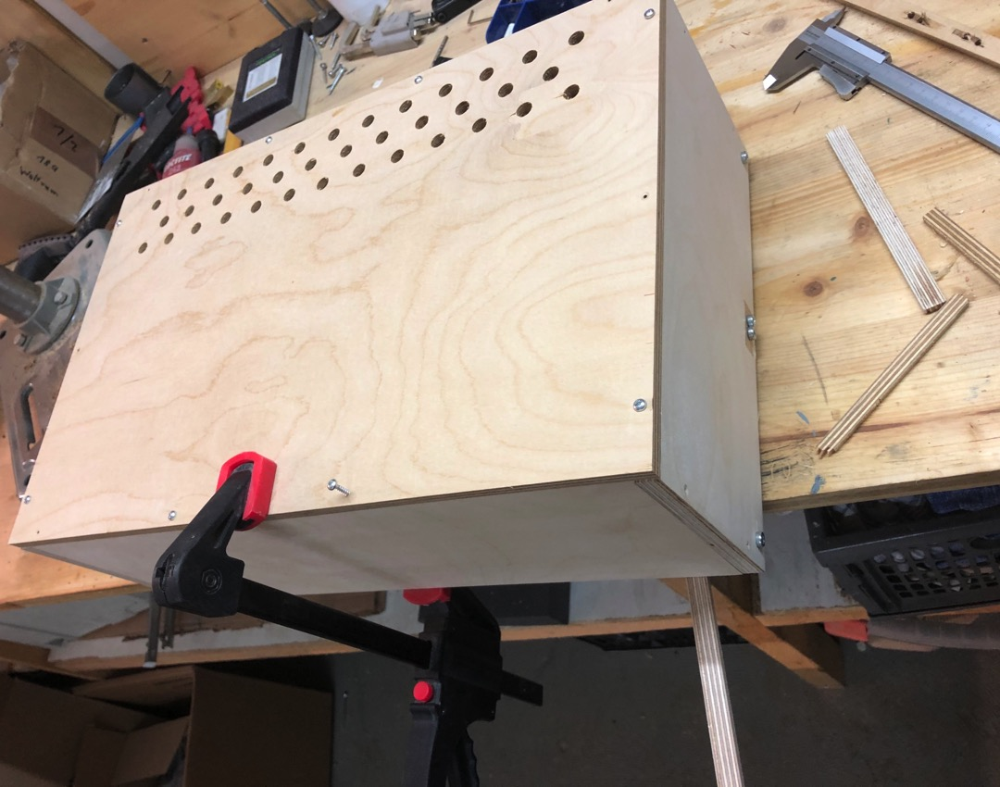
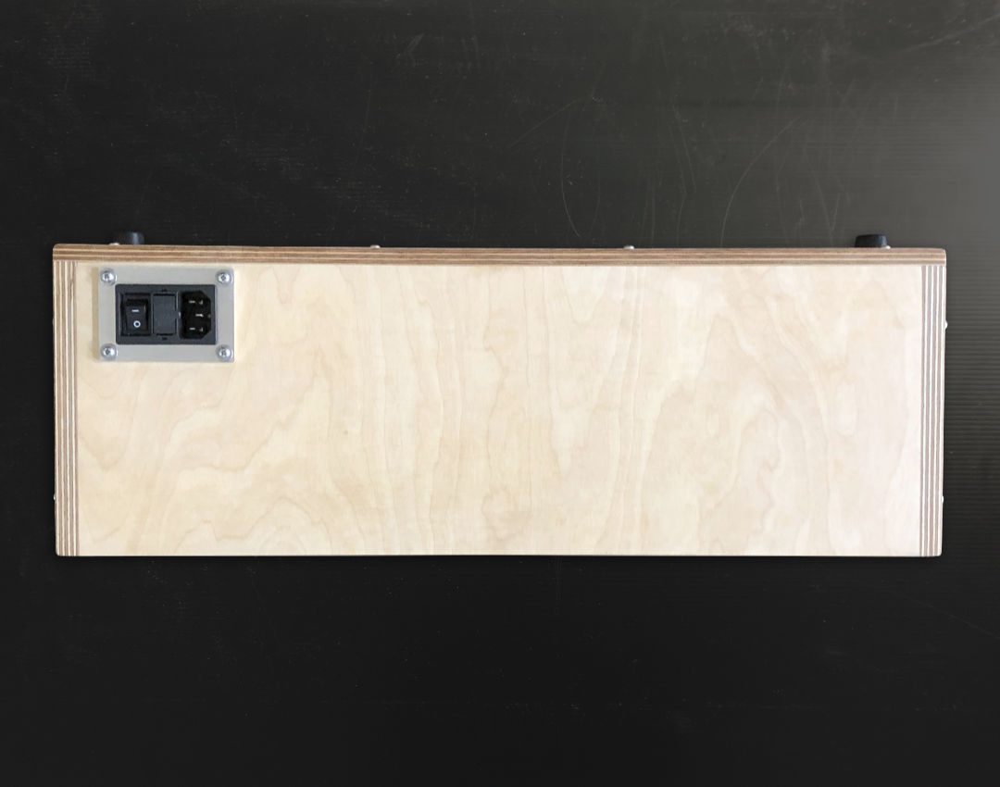
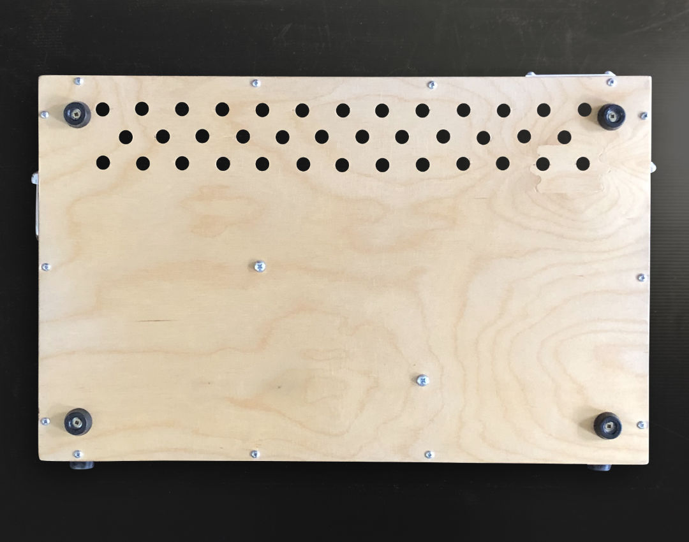
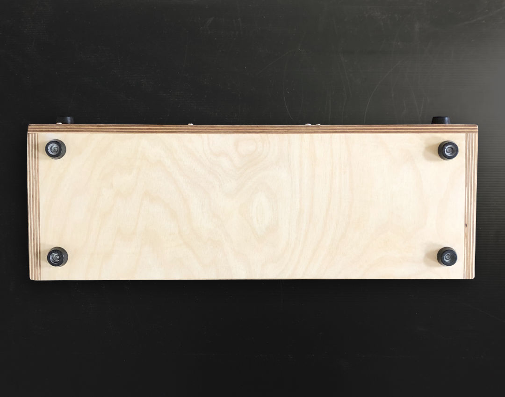
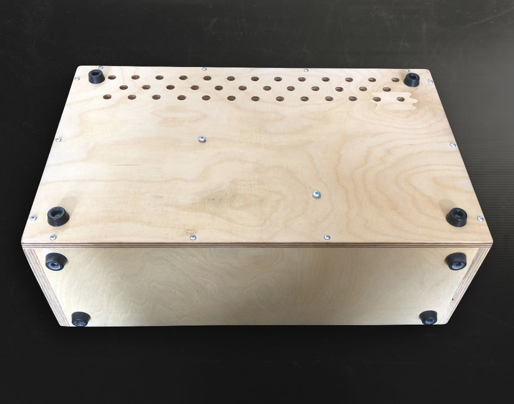
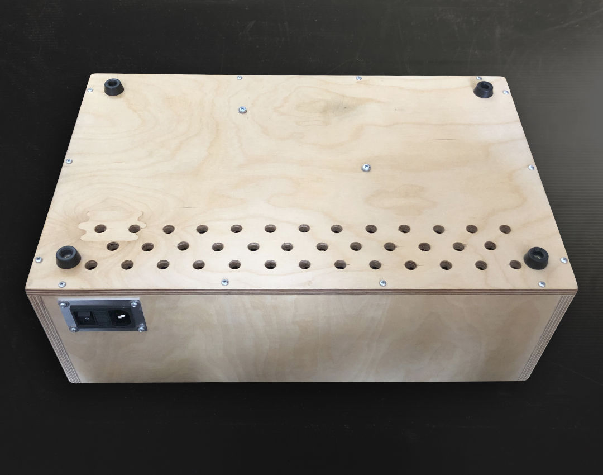
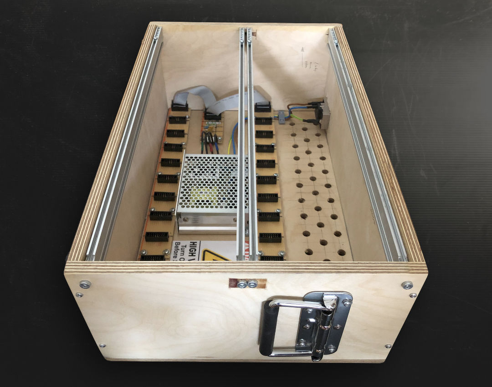
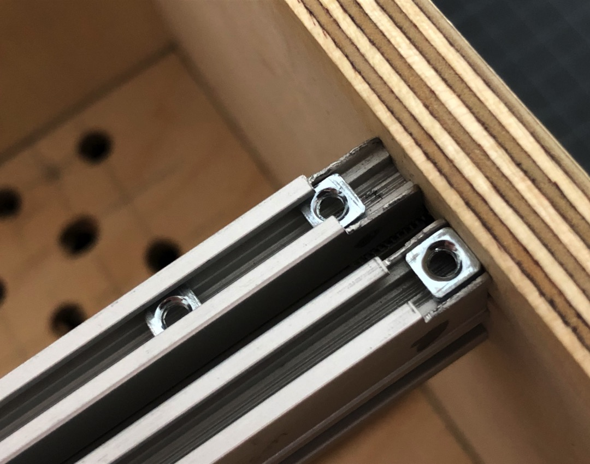

# Case II

*Version 0.1 from December 2020*

Eurorack case that I built for my modular synth drum machine project. It's built around two pairs of rails with a length of 17.05 inch (43.3 cm).

## Details

I first designed the case in a free CAD software called [SketchUp for Web](https://www.sketchup.com//products/sketchup-for-web).

The outer dimensions are (W x H x D): 457 x 290 x 162 mm.

Then I went for it in the workshop 🪚

I built the case around the rails with some blank panels to get the spacings 100%ly right.

Some fine hours later it was finished.

Top: The power plug socket is secured by an aluminum plate.

Back: The planned ventilation slots became holes. Easier to drill. 

Bottom and back: I put rubber feet on the bottom and on the back wall. So I can operate the rack standing and lying without scratching anything with the screws.

Side: After carrying the whole thing around a few times, I added handles to the sides.

Rails: They are from [Schneidersladen in Berlin](https://schneidersladen.de/). I sawed the profile at the top of all four. This way I can easily get the square nuts in.

## Links

* [Technical drawing and dimensions (PDF)](Bumm-Bumm-Garage-Case-II-0.1-Technical-Drawing-And-Bimensions.pdf) – If you're going for it, check all the dimensions and positions again carefully. I had some challenges, especially with the holes for the rails 🤓

## Improvement Potential

I would have had more space (and less fiddling) between the screws for the rails if I had installed the profiles the other way around. Next time 🤷‍♂️

<!-- Also see the comments on [Instagram](https://www.instagram.com/p/CM4tvzVBh62/) and [Reddit](https://www.reddit.com/r/synthdiy/comments/mdsjpf/simple_vco_in_eurorack_format_square_and_triangle/). -->
