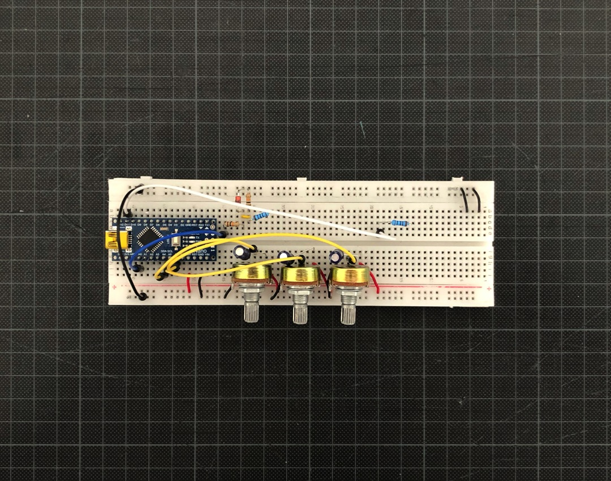
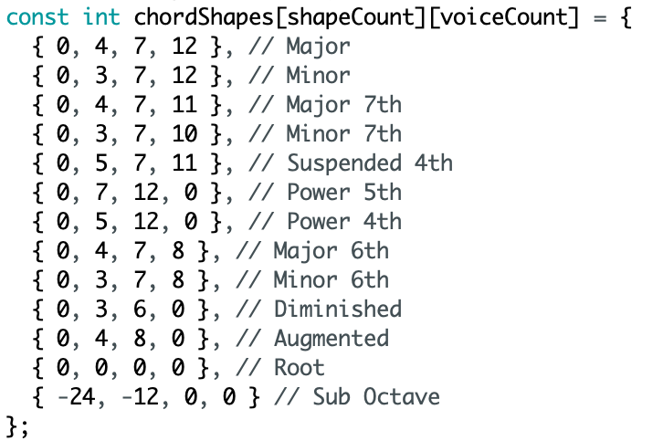

# Chord Organ

*Version 0.1 from August 2021*

**Digital polyphonic synth lead** on breadboard. I build it while having some slack time, waiting for new DIY kits for my techno rack project. The idea is taken from the [Chord Organ from Music Thing Modular](https://musicthing.co.uk/pages/chord.html).

## Features

* ✅ 4 simultaneous voices (polyphony)
* ✅ 5 different waveforms: sine, triangle, square, saw and "tuned" noise
* ✅ 13 different chord shapes (major, minor, 7th, …)
* ✅ 48 semitones (from C-2 to C+2)
* ✅ CV IN for the root note (1 volt per octave)

## Details

It is based on an **Arduino Nano**. Luckily I found the library [the_synth](https://github.com/dzlonline/the_synth). That made the implementation with some additional circuitry a relatively easy task.

The logic and design of the chord shapes are taken from the [Music Thing Modular's approach](https://youtu.be/btCs3EEpJm0?t=104). They can be edited in the code.

## Links

<!-- Video Demo
-->

* [Video Demo](Bumm-Bumm-Garage-Chord-Organ-0.1-Video-Demo-640p.mp4)
* [Schematic](Bumm-Bumm-Garage-Chord-Organ-0.1.pdf)
* [Arduino Sketch (Code)](https://github.com/bummbummgarage/bummbummgarage.github.io/blob/main/modules/chord-organ-0.1/chord-organ/chord-organ.ino)

## Improvement Potential

* Remove **noise and crackling**: 
  * This is the elephant in the room. Especially in lower tone regions you can here it. I guess this is related to the software. So far I opened an [issue in the repository](https://github.com/dzlonline/the_synth/issues/23) of the fundamental library, let's see. Fixing it by myself would be beyond my programming skills and I would rather go for building the original Chord Organ. 
  * A portion of the noise can be filtered by additional circuitry or following filter modules. But of course this comes with costs for the dynamic range as well.
  * The noise is most noticeable with the sine and triangle waves. With the rest of the waves, it almost gets lost in the overtones.
* Add a **CV IN for the chord shape**, just like the original module has one.
* Add an **opamp at the end** for amplification
* Implement it as an **Eurorack module** on stripboard or PCB.

Also see the comments on [Instagram](https://www.instagram.com/p/CSdkY_5tRsG/), [Reddit](https://www.reddit.com/r/synthdiy/comments/p2ta4x/digital_polyphonic_synth_lead_based_on_arduino/) and [Mod Wiggler](https://www.modwiggler.com/forum/viewtopic.php?f=17&t=251941).
