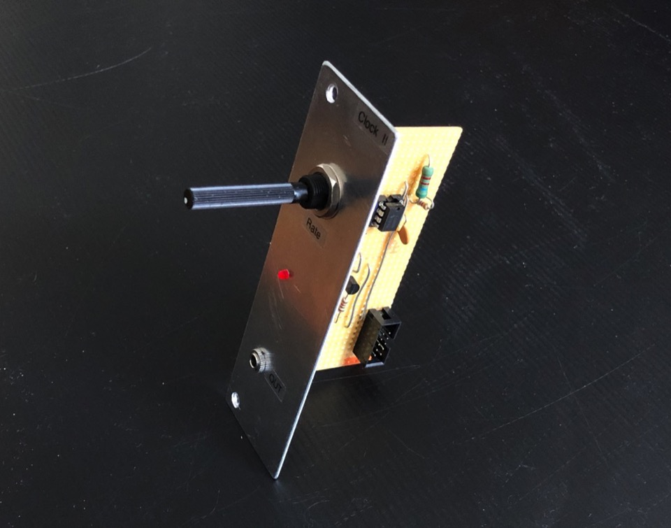
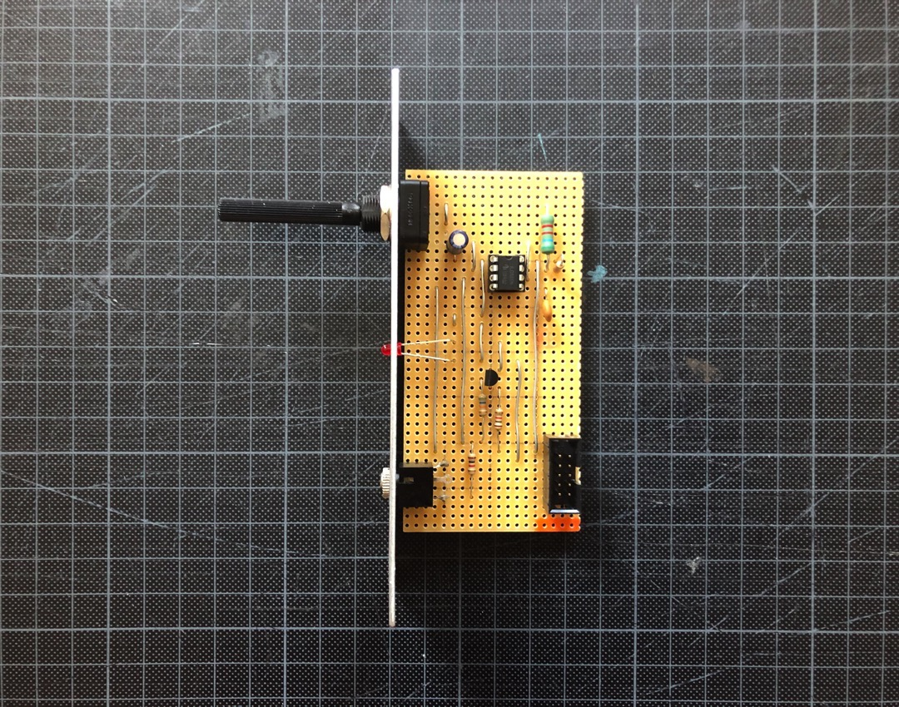
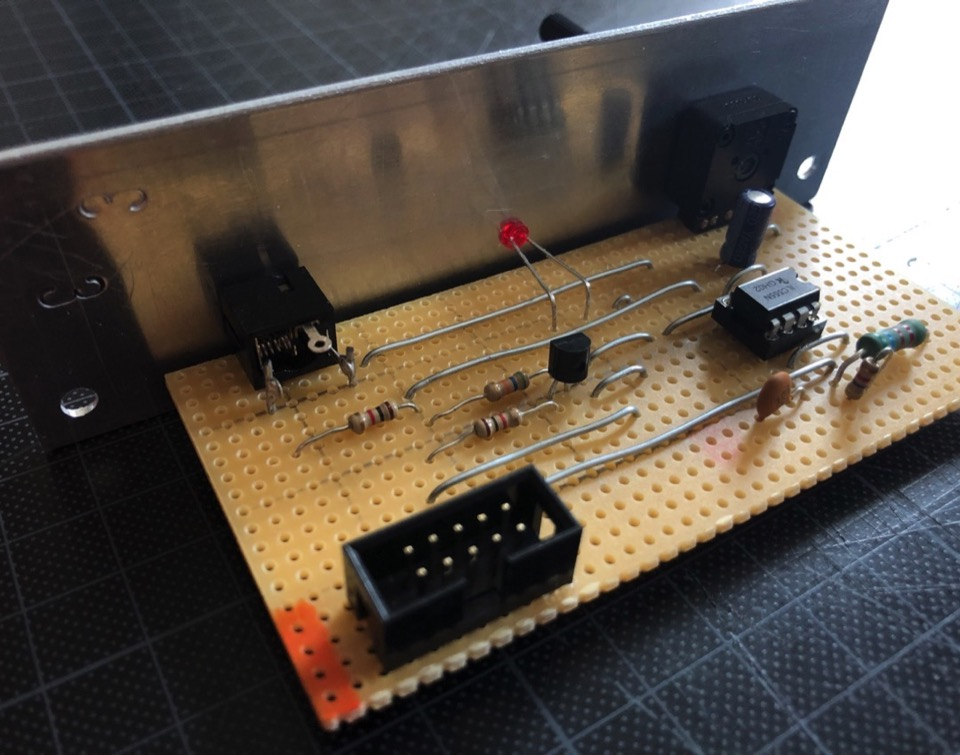

# Clock II (Gates)

*Version 0.1 from September 2020*

Clock that I built for my modular synth drum machine project 🕖

## Details

It's based on the ["Variable frequency oscillator" by jacky via circuitstoday.com](https://www.circuitstoday.com/variable-frequency-oscillator), built around a 555 timer and has a variable rate.

## Links

* [Video Demo](Video-Demo.mp4)
* [Schematic (PDF)](Bumm-Bumm-Garage-Clock-II-0.1-Schematic.pdf)
* [Stripboard Layout (PDF)](Bumm-Bumm-Garage-Clock-II-0.1-Stripboard-Layout.pdf)

## Improvement Potential

The next time I build one of these I will add the ability to change the rate ranges. This could be done with a switch for two or more capacitors instead of a C1. I would also add a gates-to-trigger converter inside this module and have an additional output for it.

<!-- Instagram + Reddit Links --> 