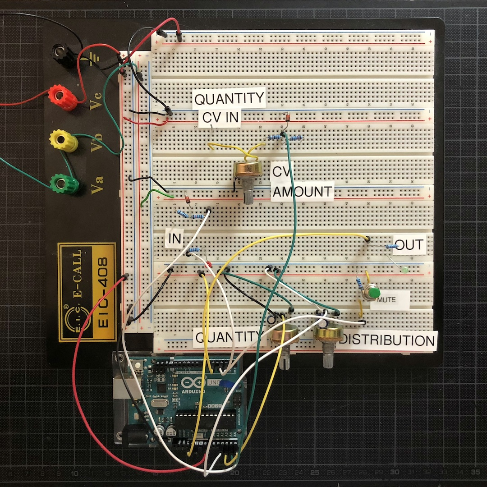

<!--

image: /modules/voltage-controlled-envelope-generator-vceg/Bumm-Bumm-Garage-Voltage-Controlled-Envelope-Generator-VCEG.jpg
description: Voltage Controlled Envelope Generator I created for my techno rack.

-->

# Clock Multiplier

<!--

## TODOs

* Output Opamp einbauen
* Use Cases finden
  * Fünftel Bass line über einen Takt
* (Startup Sequence einbauen)
* (Tap Clock einbauen)

### Features:

* Offene Schnittstelle am Modul, wenn man es hacken möchte für eigene Programme.

### ATMega Standalone

* Build an Arduino:
  * https://www.instructables.com/Build-an-Arduino/
  * https://www.instructables.com/Build-Your-Own-Arduino/
  * https://duckduckgo.com/?q=build+an+arduino&ia=web
* Arduino Uno to ATmega328 - Shrinking your Arduino Projects: https://www.youtube.com/watch?v=Sww1mek5rHU

## Resources

* **Wolles How-To**  (https://wolles-elektronikkiste.de/atmega328p-standalone-betreiben#Anker3, shorted, and done with AVR Pocket Programmer and an ATMega328P-PU):
  * Choose "Tools > Board > Arduino Uno"
  * Choose "Tools > Programmer > USBtinyISP"
  * Click "Tools > Programmer > Burn Bootloader"
  * Upload sketch via "Sketch > Upload Using Programmer"
* **ATMega Digital and Analog Pins**: https://www.componentsinfo.com/atmega328p-pinout-configuration-datasheet/
* **Overvoltage Protection:**
  * https://forum.arduino.cc/t/12v-to-arduino-pin-zener-diode/529876/2#msg3759664

## Fragen

* Wie bekomme ich den ISP Programmer drauf (dann mit Strom oder ohne)?
  * ISP and power supply
* Welche Decoupling Caps für den ATMega mit dem uA7805?

-->
