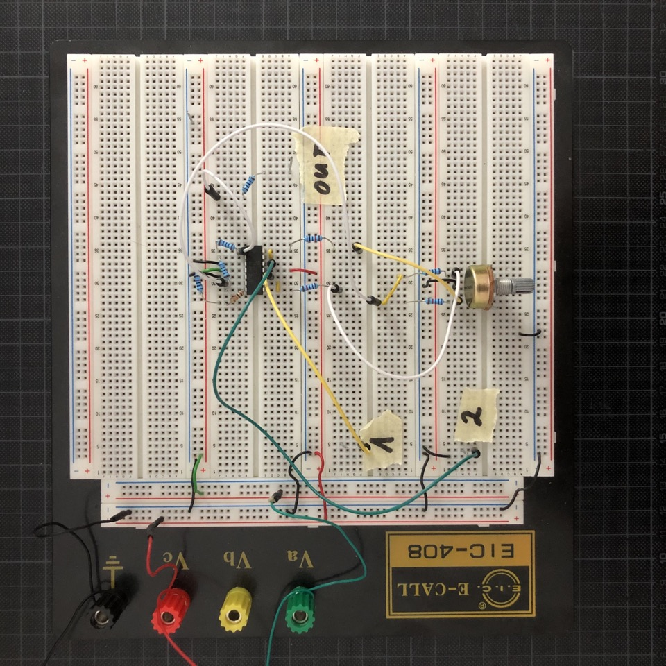

# Crossfader

Crossfader that I built for wet and dry control of my distortion module.

## Resources

**Revision 1 (breadboard prototype)**

* [Schematics (PDF)](Rev1/Bumm-Bumm-Garage-Crossfader-Rev1-Schematic)
