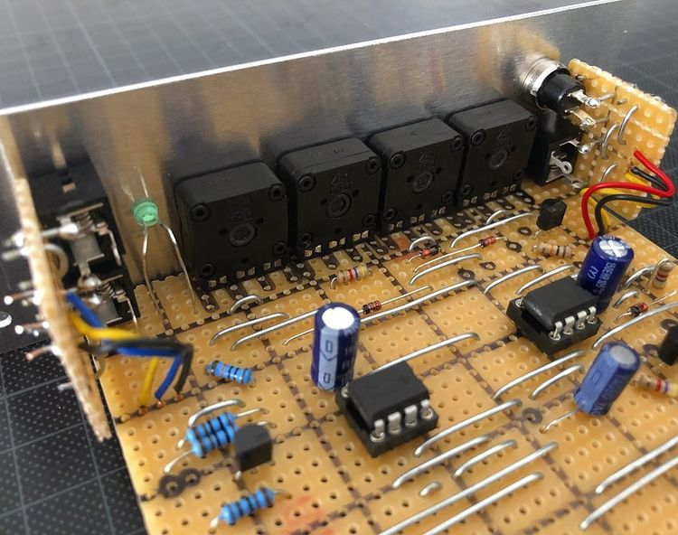

# Envelope Generator

*Version 0.1 from September 2020*

Here's the first Envelope Generator (ADSR) that I built for my drum machine project. It's based on ["The Fastest Envelope in the West" by René Schmitz](https://www.schmitzbits.de/adsr.html) which is comparably easy to build and works awesomely! I modified and extended it a bit for my purpose (changed R and C values and added some peripherals).

## Features

* ✅ Full stack envelope (attack, decay, sustain and release)
* ✅ Manual trigger
* ✅ 2 outputs (for e.g. VCO pitch and VCA)

## Details

## Links

* [Video Demo](Bumm Bumm Garage EnvGen 0.1 Video Demo 720p.mp4)
* [Schematic (PDF)](Bumm Bumm Garage EnvGen 0.1 Schematic.pdf)
* [Stripboard Layout (PDF)](Bumm Bumm Garage EnvGen 0.1 StripboardLayout.pdf)
* [Front Panel (PDF)](Bumm Bumm Garage EnvGen 0.1 Panel.pdf)

## Improvement Potential

Sustain is probably not 100% stable. You can hear it a few milliseconds after the tone starts (pitch goes down). Fortunately that's not a show stopper for my drum machine project, because I mostly just need some decay and release.

Also see the comments on [Instagram](https://www.instagram.com/p/CFw7gsPBfNJ/) and [Reddit](https://www.reddit.com/r/synthdiy/comments/j2nl4z/envelope_generator_adsr_in_eurorack_format_on/).

