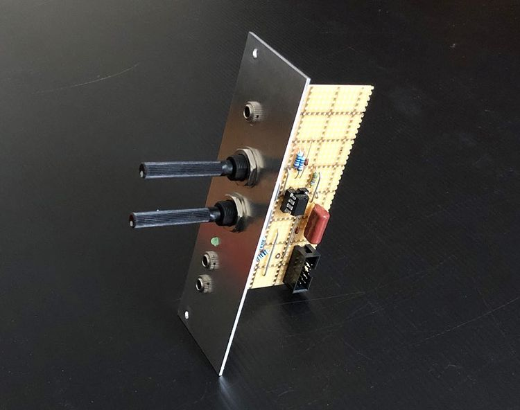

## Envelope Generator II

*Version 0.1 from February 2021*

Envelope Generator that I built for my modular synth drum machine project. It's based on the ["Simple DIY Envelope Generator" by Look Mum No Computer](https://www.lookmumnocomputer.com/simple-envelope-generator) 🥳

### Features

✅ Attack and release

✅ 2 outputs (for e.g. VCO pitch and VCA)

✅ Visual indication a.k.a. LED

### Details

### Improvement Potential

Unfortunately the output voltage equals the input voltage in this implementation. That means only +5V coming from my sequencer. That is not sufficient for all my instruments on the drum machine 🤷‍♂️. The snare needs a higher peak of 10 V or more in the envelope.

### Links

* [Video Demo](Bumm Bumm Garage EG II 0.1 Video Demo 640p.mp4)
* [Schematic (PDF)](Bumm Bumm Garage EG II V0.1 Schematic.pdf)
* [Stripboard Layout (PDF)](Bumm Bumm Garage EG II V0.1 Stripboard Layout.pdf)
* [Front Panel (PDF)](Bumm Bumm Garage EnvGen II V0.1 Panel.pdf)
* [Feedback on Instagram](https://www.instagram.com/p/CLZmitlh9HO/)
* [Feedback on Reddit](https://www.reddit.com/r/synthdiy/comments/llymt2/envelope_generator_ar_in_eurorack_format_on/)