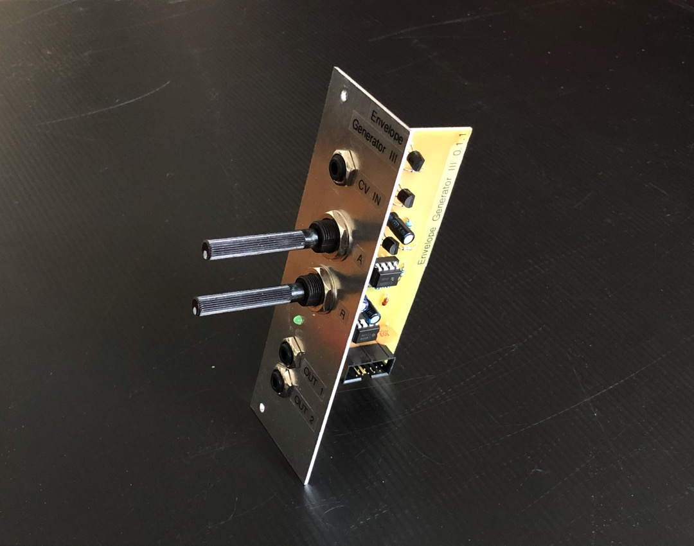
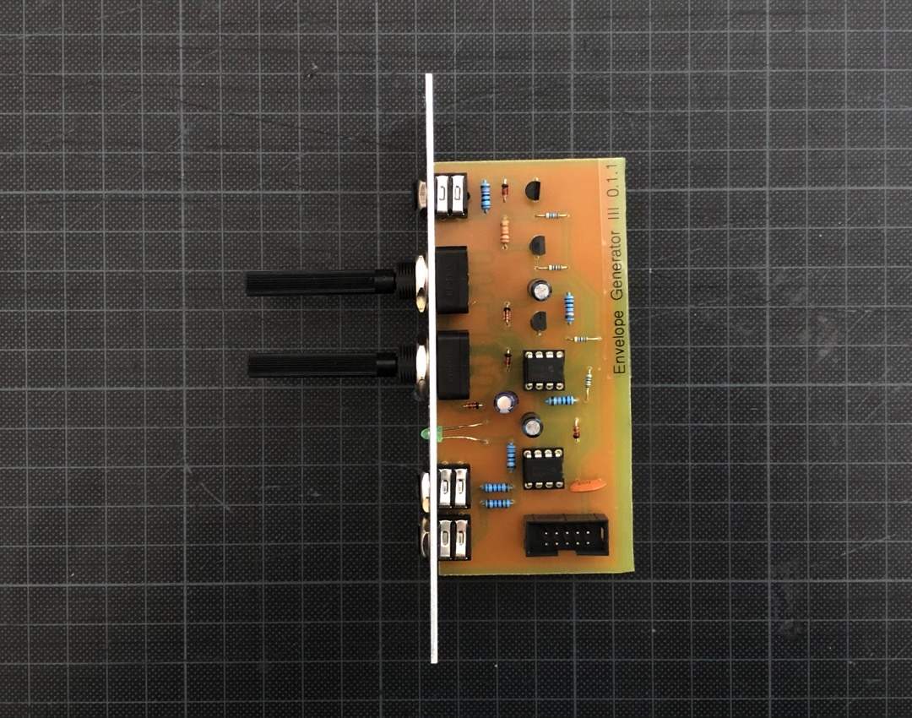
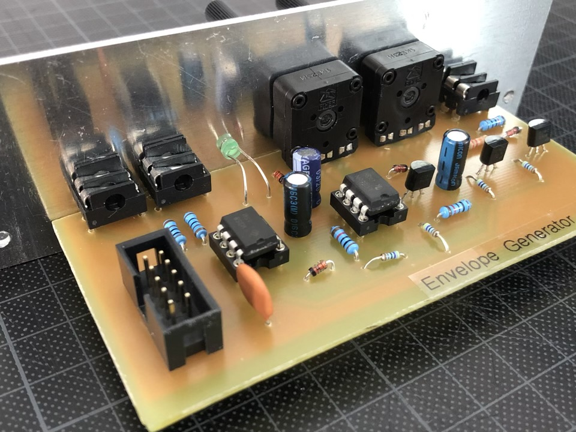
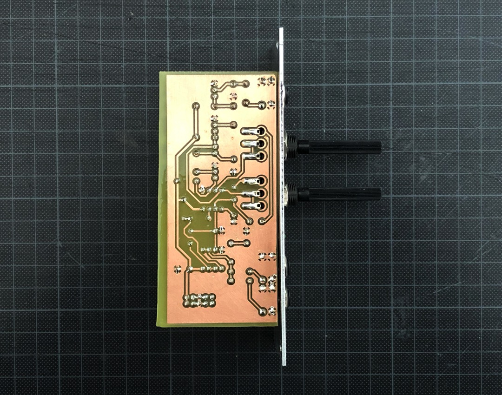

## Envelope Generator III

*Version 0.1.1 from March 2021*

Envelope Generator that I built for my modular synth drum machine project.

## Features

* ✅ Attack and release
* ✅ 2 outputs (for e.g. VCO pitch and VCA)
* ✅ Visual indication a.k.a. LED

## Details

It's based on ["The Fastest Envelope in the West" by René Schmitz](https://www.schmitzbits.de/adsr.html). I removed the Decay and Sustain from the original design. Both were not crucial to my drum machine project. 

The potis I use here are from Piher (PC-16 series) and the jack sockets are from Cliff (FCR1281).

## Resources

* [Video Demo](Bumm-Bumm-Garage-Envelope-Generator-III-0.1.1-Video-Demo.mp4)
* [Schematic (PDF)](Bumm-Bumm-Garage-Envelope-Generator-III-0.1.1-Schematic.pdf)
* [Breadboard Prototype (PDF)](Bumm-Bumm-Garage-Envelope-Generator-III-0.1.1-Breadboard-Prototype.pdf)
* [PCB Bottom Layer (PDF)](Bumm-Bumm-Garage-Envelope-Generator-III-0.1.1-PCB-Bottom-Layer.pdf)
* [Front Panel (PDF)](Bumm-Bumm-Garage-Envelope-Generator-III-0.1.1-Panel.pdf)

## Improvement Potential

At the beginning there is a small unwanted voltage spike. You can hear it in the video. In my case no problem, because I use the release only in my drum machine project.

Also see the comments on [Instagram](https://www.instagram.com/p/CNuiDEiBc5Y/) and [Reddit](https://www.reddit.com/r/synthdiy/comments/ms2epn/envelope_generator_ar_in_eurorack_format/).