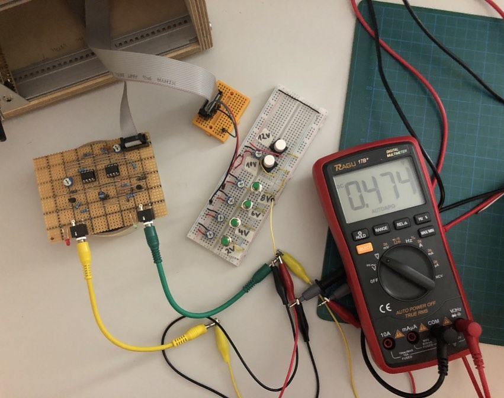

## Exponential Converter

*Version 0.1 from February 2021*

Exponential Converter that I built for my modular synth drum machine project. I wanted a snappy release based on the linear one from the Envelope Generator (EG). This will make the snare drum sound natural. With the trimmers I set it to peak at 8 volts input because my EGs have a maximum output of 8 volts.

It's based on a Design by Robin Mitchell in ["DIY Synth Series Part 1 — The Exponential VCO"](https://www.allaboutcircuits.com/projects/diy-synth-series-vco/).

To find transistors with the same HFE, you have to match them. I used the instructions described in ["Transistor matching" by Kassutronics](https://kassu2000.blogspot.com/2015/10/transistor-matching.html) 👍

For the calibration I build a testing circuit with different voltage inputs (set by trimpots) and checked the output with a multimeter. You can see a photo of that and the resulting chart below.

### Details

### Links

* [Video Demo](Bumm Bumm Garage Exponential Converter 0.1 Video Demo 640p.mp4)
* [Schematic (PDF)](Bumm Bumm Garage ExpConv 0.1 Schematic.pdf)
* [Stripboard Layout (PDF)](Bumm Bumm Garage ExpConv 0.1 Stripboard Layout.pdf)
* [Front Panel (PDF)](Bumm Bumm Garage Exponential Converter 0.1 Panel.pdf)
* [Feedback on Instagram](https://www.instagram.com/p/CLwjxVGh8AB/)
* [Feedback on Reddit](https://www.reddit.com/r/synthdiy/comments/lt0a0m/exponential_converter_in_eurorack_format_on/)