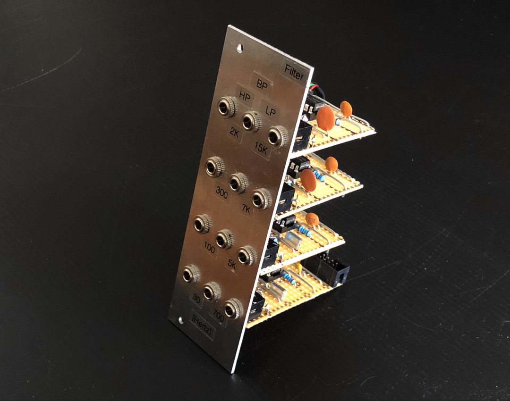
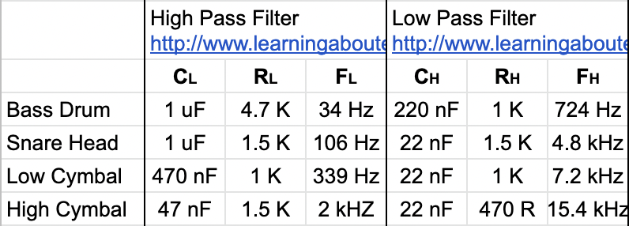
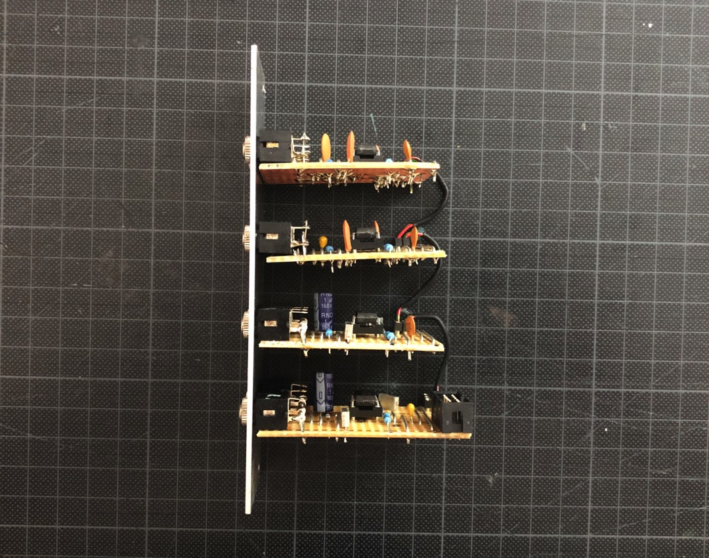

## Filter

*Version 0.2 from March 2021*

Fixed filter bank that I built for my drum machine project. 

## Details

It's inspired by the [PROPUST Tripple Passive Filter by Bastl Instruments](https://bastl-instruments.com/eurorack/modules/propust). The idea is to have four "passive filters with fixed cutoff frequencies for highpass and lowpass stages". They "can help you clean up your final mix and make room for each sound, or they can be used for filtering noises and other signals when generating drum sounds, for instance" . 

I arranged the values so that they would match the planned setup of kick, snare and hihat/cymbal.

## Links

* [Schematic (PDF)](Bumm-Bumm-Garage-Filter-0.2-Schematic.pdf)
* [Stripboard Layout (PDF)](Bumm-Bumm-Garage-Filter-0.2-Stripboard-Layout.pdf)
* [Front Panel (PDF)](Bumm-Bumm-Garage-Filter-0.2-Front-Panel.pdf)

## Improvement Potential

Clearly it need be mentioned that the filtered noise for the hihat becomes hard to hear without any further **amplification**.

