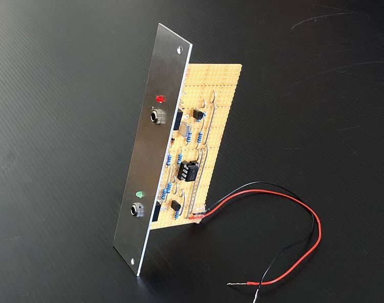
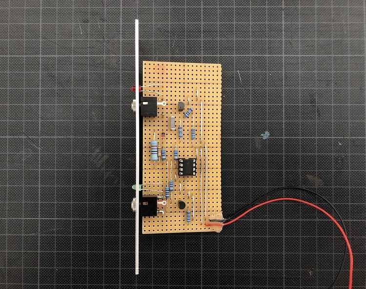
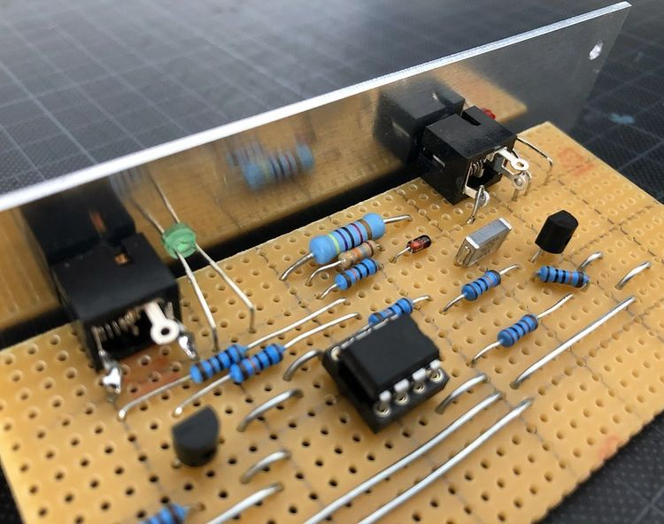

## Gate to Trigger Converter

*Version 0.1 from September 2020*

Gate to Trigger Converter that I built for my drum machine project. I realized that the outcome of my gate generator (clock) that is fed into the ADSR prototype didn't result in sufficiently snappy drum hits. So I pulled together this simple module to have short triggers. It is based on the ["Gate to Trigger Converter" by Ken Stone](https://www.elby-designs.com/webtek/cgs/cgs24/cgs24_gatetotrigger.html).

### Details

### Links

* [Video Demo](Bumm Bumm Garage Gate to Trigger Converter Stripboard 0.1 Video Demo 720p.mp4)
* [Schematic (PDF)](Bumm Bumm Garage Gate to Trigger Converter 0.1 Schematic.pdf)
* [Stripboard Layout (PDF)](Bumm Bumm Garage Gate to Trigger Converter Stripboard 0.1 Layout.pdf)
* [Front Panel (PDF)](Bumm Bumm Garage Gate to Trigger Converter Stripboard 0.1 Panel.pdf)
* [Feedback on Instagram](https://www.instagram.com/p/CFrUifjhRo_/)
* [Feedback on Reddit](https://www.reddit.com/r/synthdiy/comments/j19mxy/gate_to_trigger_converter/)