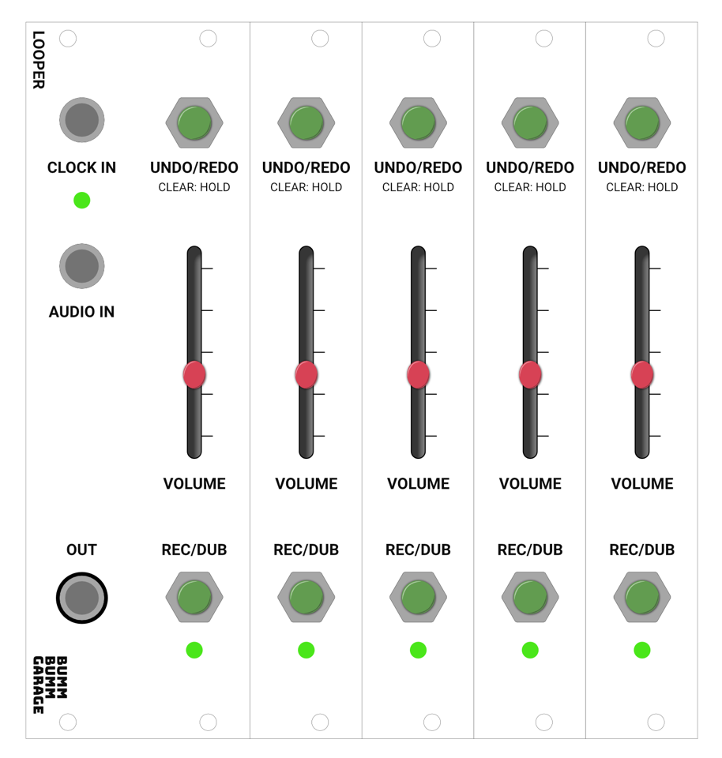

<!-- Add description, image -->

# Looper

## Features

* ✅ Endless overdubs per track
* ✅ Quantised recording (via clock input)
* ✅ Undo / redo and clear function per track
* ✅ Loop length indication (via colors on the track LED)
* ✅ Basic module that can be expanded (5 tracks overall)
* ✅ Volume control per track
* ✅ Performance oriented design (sufficient space between all control elements)

## Similar modules

Mentioned by the community

* [**ADDAC112**](https://www.addacsystem.com/en/products/modules/addac100-series/addac112) (Manu)
* **[Poly beebo/Hector](https://www.polyeffects.com/polyeffects/p/hector)** (via Reddit)
* **[After Later Typhoon](https://afterlateraudio.com/products/typhoon)** (via Reddit)
* [**Disting EX**](https://www.expert-sleepers.co.uk/distingEX.html) (via Modwiggler)
* [**Bitbox – Sampler**](https://1010music.com/product/bitbox-eurorack-module-with-touchscreen) (via Modwiggler)
* **[Ephemere](https://www.gearnews.com/ephemere-dual-channel-cv-and-modulation-recorder/)**

## Microcontrollers

Mentioned by the community

* [**Daisy Seed**](https://www.electro-smith.com/daisy/daisy) (via Reddit)
* Rasberry Pi (Microcontrollers 133MHz) (Tom W., Hagen)
* AVR dB 128 (microchip series) (Hagen)

## Software

* https://www.pjrc.com/teensy/td_libs_Audio.html
* https://www.electro-smith.com/daisy/daisy

## Resources

**Revision 0.1 (initial pitch)**

* Showcase and feedback on [Modwiggler](https://www.modwiggler.com/forum/viewtopic.php?p=3779166#p3779166), [Reddit](https://www.reddit.com/r/synthdiy/comments/vghybq/looper_eurorack_module_with_multiple_tracks/) and [Instagram](https://www.instagram.com/p/CfBe22DMyp6/)

<!--

#### Sample Rate and Bit Depth

**Basically**

https://electro-smith.github.io/libDaisy/md_doc_md__a3__getting__started__audio.html

* Typical CDs are at 44.1kHz, High-fidelity samplerates start at 96kHz.

* typical CD audio is 16-bits
* Audio File Size Calculator: https://www.theaudioarchive.com/TAA_Resources_File_Size.htm

**Recording length and file sizes** 

|      | Length          | … bei 130 BPM | File size (44,1kHz, 24bit, Mono) |
| ---- | --------------- | ------------- | -------------------------------- |
| Kick | 1 bar, 4 hits   | 1,8 s         | < 1MB                            |
| Lead | 4 bars, 16 hits | 7,3 s         | 0,8 MB                           |

**BOSS RC-505 MkII**

https://www.musikhaus-korn.de/de/boss-rc-505-mk2-loop-station/pd/189900

- Sample-Rate: 44,1 kHz
- AD/DA Wandlung: 32 bits
- Prozessor: 32-bit floating point

**BOSS RC-505**

https://www.boss.info/global/products/rc-505/specifications/

* 44.1 kHz, 16-bit linear, stereo

**Daisy**

https://electro-smith.github.io/libDaisy/md_doc_md__a3__getting__started__audio.html

* On the daisy, the hardware uses **24-bit audio** … (beyond 16-bits, the difference becomes less and less noticeable)
* Daisy's audio engine uses 32-bit floats to work with audio
* 64MB Speicher

#### Similiar projects

* https://forum.electro-smith.com/search?q=looper
  * https://github.com/misterinterrupt/PatchLooperExample
  * https://forum.electro-smith.com/t/live-coding-a-daisy-patch-granular-sampler/2210

-->
