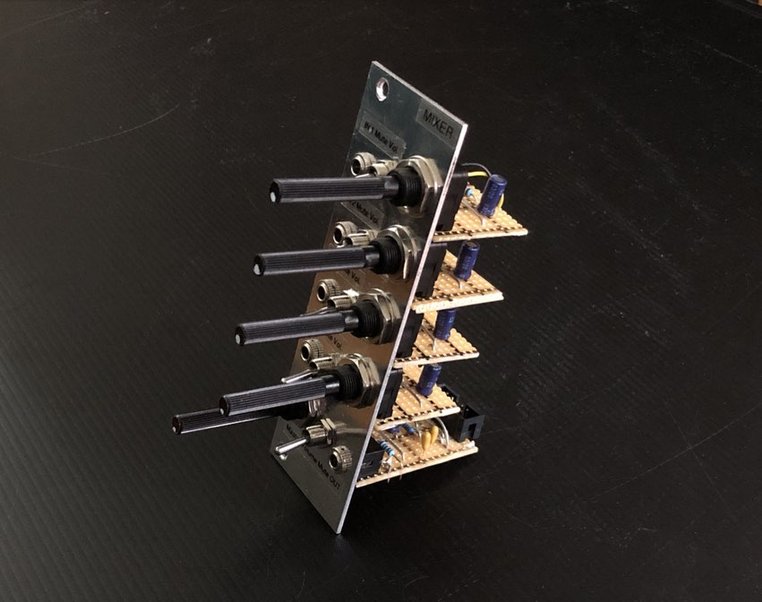
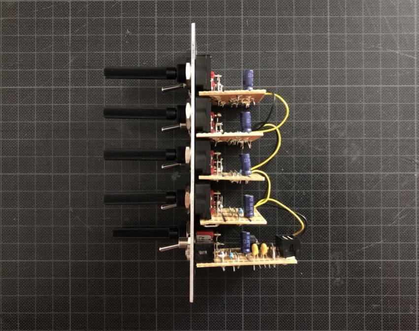
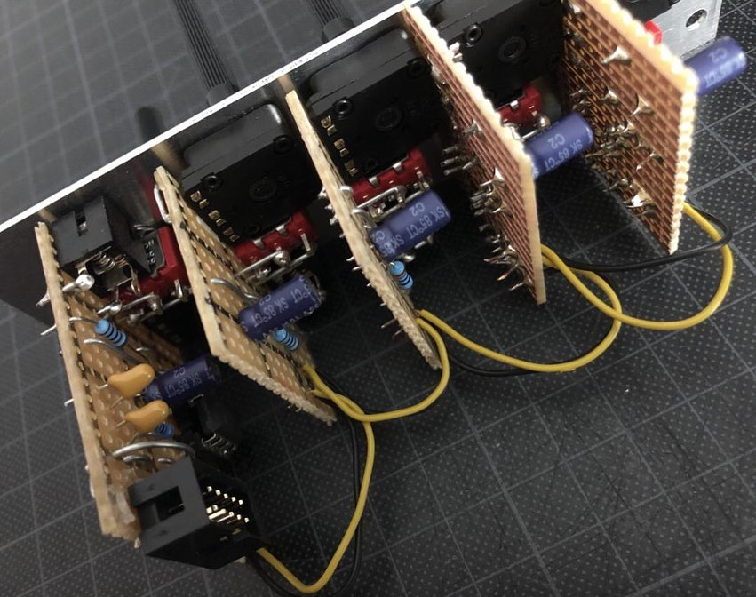

# Mixer

*Version 0.1 from March 2021*

Mixer that I built for my modular synth drum machine project. Fun fact: At 110g, it's currently the heaviest of my modules – because it has the most controls per square inch.

## Features

* ✅ 4 channels
* ✅ Volume and mute per channel
* ✅ Master volume and mute

## Details

The schematic is based on ["Introduction to Op-Amps - Part 2" by Jens Moller on colomar.com](http://colomar.com/Shavano/intro_opamp2.html).

The pots I use here are from Piher (PC-16 series), the jack sockets are from Lumberg (part number 1502 03) and the switches are from RND Electronics (ON-ON, SPDT).

The module can easily be extended with channels. Copy the according part in the schematic and stripboard layout, connect the lines and nothing will stop you 🚀

## Links

* [Video Demo](Bumm Bumm Garage Mixer 0.1 Video Demo 640p.mp4)
* [Schematic (PDF)](Bumm Bumm Garage Mixer 0.1 Schematic.pdf)
* [Stripboard Layout (PDF)](Bumm Bumm Garage Mixer 0.1 Stripboard Layout.pdf)
* [Front Panel (PDF)](Bumm Bumm Garage Mixer 0.1 Panel.pdf)

## Improvement Potential

Make it an active mixer with one OpAmp per channel. This way each channel is buffered and independent from the others. ["Multi channel audio mixer circuit using LM3900" by April Jay](https://circuitmaker.com/Projects/Details/April-Jay/Multi-channel-audio-mixer-circuit-using-LM3900) would be a starting point. Delete the preset potentiometer and replace the gain loop’s resistor by a potentiometer. Thanks for the hint, TC!

All in all, the controls at the front are very tight. Unmuting the channels is easy because it is a downward movement with the finger. Muting takes some practice.

Also see the comments on [Instagram](https://www.instagram.com/p/CMxVuXAh2HL/) and [Reddit](https://www.reddit.com/r/synthdiy/comments/mbnqt3/4_channel_mixer_in_eurorack_format_on_stripboard/).
