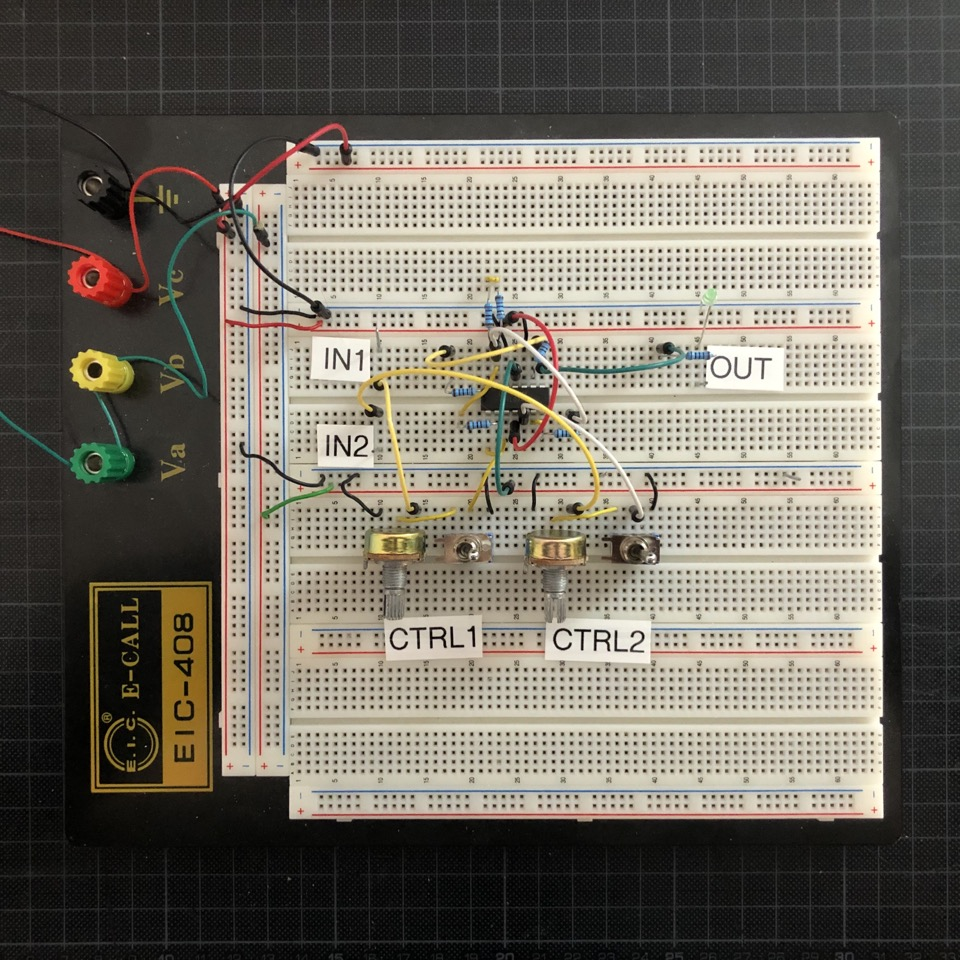

<!-- image: modules/vcf/Bumm-Bumm-Garage-VCF-Rev3.jpg -->

# Mixer II

Ultra simple two-channel mixer in 2hp. You can mix audio signals, such as control voltage, like envelopes. There are attenuators and mute switches per channel.

I built the first iteration of this module for my techno rack. I needed a slim mixer to sum the two channels of my hihats module because I didn't have more channels left on my main mixer 💡

In the second run, I then needed the requirement to be able to sum control voltage as well. I wanted a way to mix envelopes for side chaining and have them non-inverted.

## Features

* ✅ 2 channels
* ✅ Attenuation and mute per channel
* ✅ Mixes audio signals and control voltage
* ✅ Buffered inputs

## Resources

**Revision 1 (stripboard prototype)** 

* [Schematic (PDF)](Rev1/Bumm-Bumm-Garage-Mixer-II-Rev1-Schematic.pdf)
* [Stripboard Layout (PDF)](Rev1/Bumm-Bumm-Garage-Mixer-II-Rev1-Breadboard-Layout.pdf)

**Revision 2 (non-inverted output, breadboard prototype)**

* [Video Demo: Mixing Hihats](https://www.youtube.com/watch?v=7dPILYZzBcs)
* [Video Demo: Mixing Envelopes](https://www.youtube.com/watch?v=XjyHBZ8SafI)
* [Schematic (PDF)](Rev2/Bumm-Bumm-Garage-Mixer-II-Rev2-Schematic.pdf)
* **Improvement potential**: Remove clicks when muting with the switches and add missing overall gain.

<!--

Demo Videos:

* Mixing hihats
* Mixing envelopes in side chaining

-->

<!--

Rev2 Improvment Potential:

* Remark: DC offset will not be removed. Audio can be strange if it has DC offset.
* Clicking when muting.

-->
