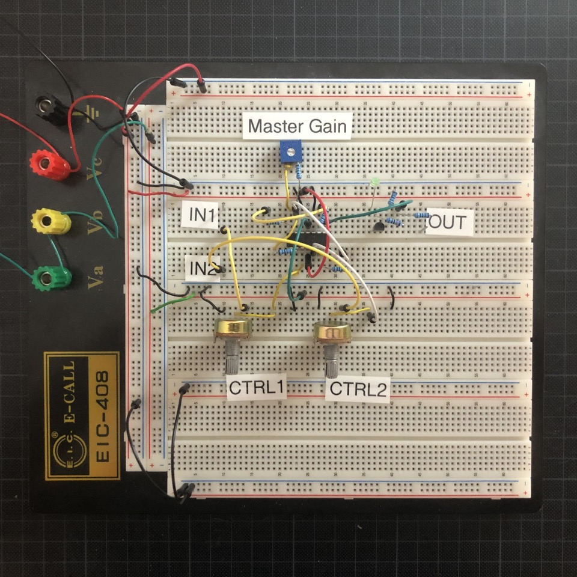

# Mixer II

Ultra simple two-channel mixer in 2hp. You can mix audio signals, such as control voltage, like envelopes. There are attenuators and mute switches per channel.

I built the first iteration of this module for my techno rack. I needed a slim mixer to sum the two channels of my hihats module because I didn't have more channels left on my main mixer 💡

In the second run (revision 2), I then needed the requirement to be able to sum control voltage as well. I wanted a way to mix envelopes for side chaining and have them non-inverted.

At some point it bothered me more and more that it clicked so much in the sound when muting with the switches. That's why I removed them completely with revision 3. Mute is still possible with the volume pots. I also missed the variable master gain, with which I could still adjust the output, especially when mixing envelopes from other modules. That's why I added it as a trimpot to be more flexible.

## Features

* ✅ 2 channels
* ✅ Attenuation per channel
* ✅ Mixes audio signals and control voltage
* ✅ Variable master gain
* ✅ Buffered inputs

## Resources

**Revision 1 (stripboard prototype)** 

* [Schematic (PDF)](Rev1/Bumm-Bumm-Garage-Mixer-II-Rev1-Schematic.pdf)
* [Stripboard Layout (PDF)](Rev1/Bumm-Bumm-Garage-Mixer-II-Rev1-Breadboard-Layout.pdf)

**Revision 2 (breadboard prototype)**

What's new? Implemented a non-inverted output.

* [Video Demo: Mixing Hihats](https://www.youtube.com/watch?v=7dPILYZzBcs)
* [Video Demo: Mixing Envelopes](https://www.youtube.com/watch?v=XjyHBZ8SafI)
* [Schematic (PDF)](Rev2/Bumm-Bumm-Garage-Mixer-II-Rev2-Schematic.pdf)

**Revision 3 (breadboard prototype)**

What's new? Removed switches (and thereby their clicking) and added variable master gain.

* [Video Demo: Mixing Hihats](https://www.youtube.com/watch?v=H-lA9sQpHlk)
* [Video Demo: Mixing Envelopes](https://www.youtube.com/watch?v=vhxrNxvZDss)
* [Schematic (PDF)](Rev3/Bumm-Bumm-Garage-Mixer-II-Rev3-Schematic.pdf)
* Showcase and feedback on [Reddit](https://www.reddit.com/r/synthdiy/comments/s9y0wm/two_channel_mixer_for_audio_and_cv_breadboard/).

<!--

Rev2 Improvment Potential:

* Remark: DC offset will not be removed. Audio can be strange if it has DC offset.

-->
