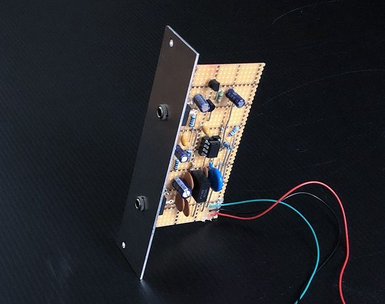
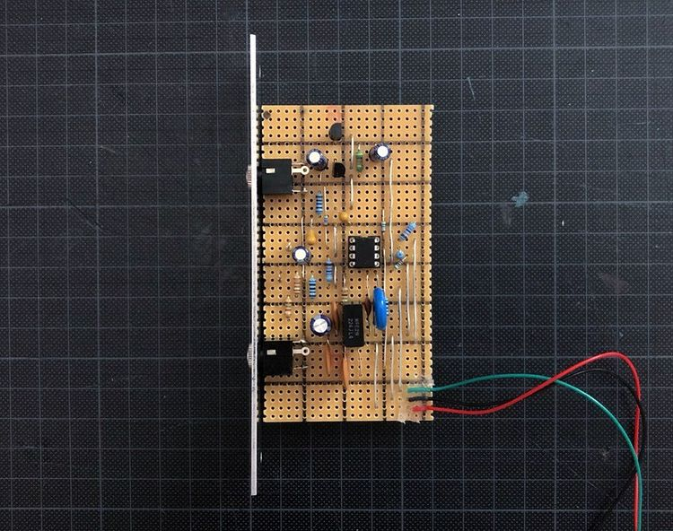
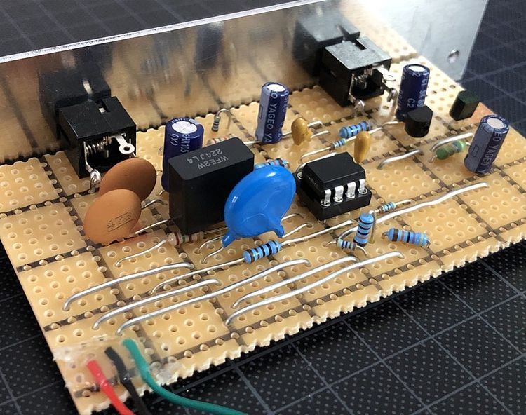

# Noise Generator

*Version 0.2 from November 2020*

Noise generator that I built for my modular synth drum machine project. It includes white and pink noise for the basis of hi-hats and a snare drum. The circuit needs at least +/-12V to run.

The design is based on ["2tran_wn.gif" by richardc64 via electro-music.com](https://electro-music.com/forum/post-377739.html#377739) (white noise) and ["Noise source with passive filter" by SyntherJack](https://syntherjack.net/make-some-pink-noise-generator/) (pink noise filter).

## Details

## Links

* [Video Demo](Bumm Bumm Garage Noise Generator 0.2 Video Demo 720p.mp4)
* [Schematic (PDF)](Bumm Bumm Garage Noise Generator 0.2 Schematics.pdf)
* [Stripboard Layout (PDF)](Bumm Bumm Garage Noise Generator 0.2 Stripboard Layout.pdf)
* [Front Panel (PDF)](Bumm Bumm Garage Noise Generator 0.2 Panel.pdf)

## Improvement Potential

While plugging in the oscilloscope for the first time, I just realized the DC bias in the white noise – to be removed in future development. 

Also see the comments on [Instagram](https://www.instagram.com/p/CILTJSfBd1S/) and [Reddit](https://www.reddit.com/r/synthdiy/comments/k39n6u/noise_generator_white_pink/).