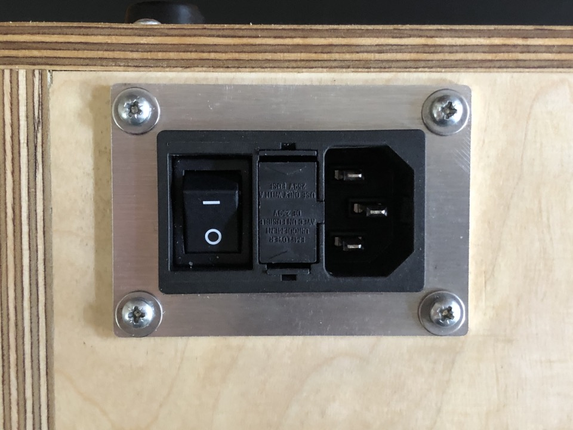
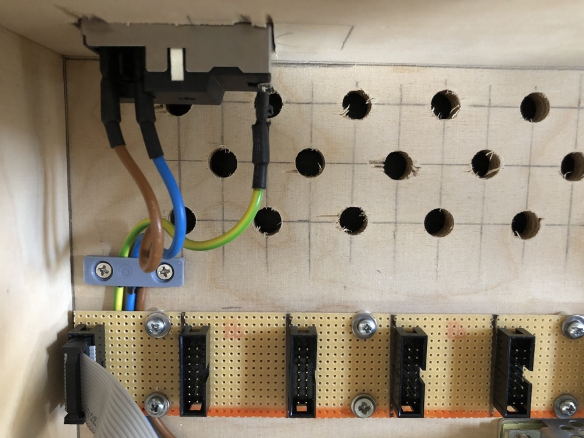
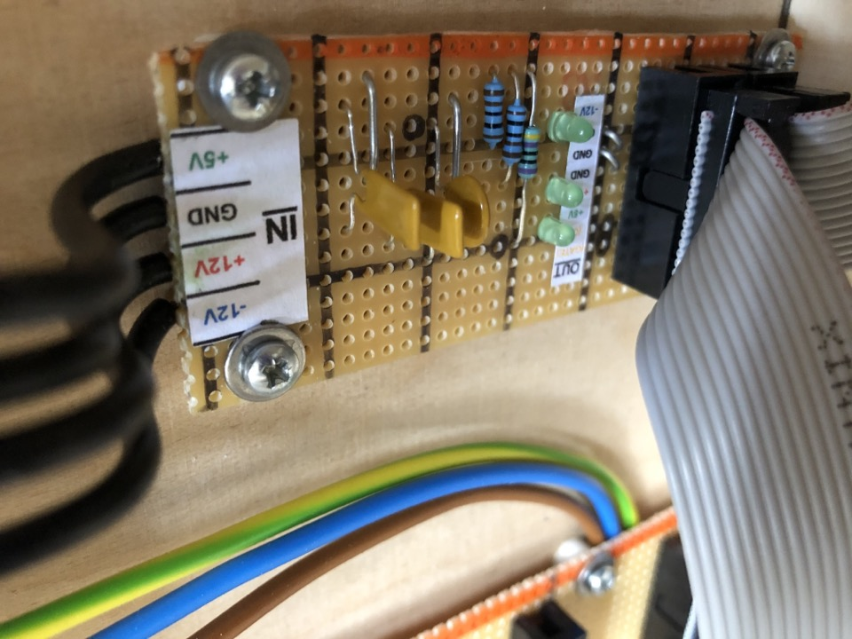
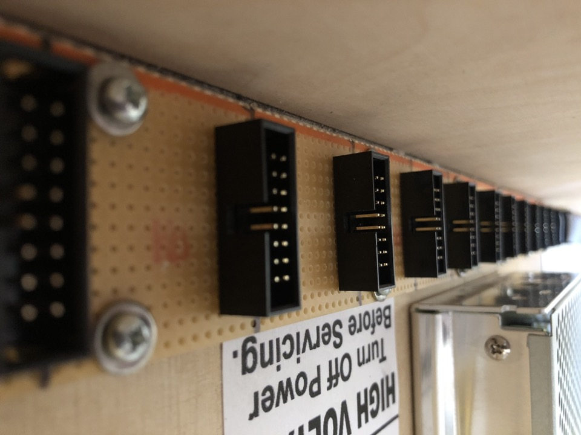

# PSU & Distro Board

*Version 0.1 from December 2020*

Power supply unit and power distribution board that I built for my modular synth drum machine project. At its core there's a Meanwell RT-65B.

That to be said: **Please be extra sure about what you're doing**. Such things can easily kill you ☠️

## Details

I got the concept here mainly from the following sources. If you want to develop and build something like this, I recommend you to consider them:

* [DIY power supply - Meanwell RT-65b - will this kill me?](https://modwiggler.com/forum/viewtopic.php?p=3081619)
* [Case Wiring, two Meanwell RT-65B](https://modwiggler.com/forum/viewtopic.php?f=17&t=211316)
* [Power wiring for multiple bus boards](https://modwiggler.com/forum/viewtopic.php?t=53338)

And here's what I made out of this.

The connector socket is firmly seated in an aluminum plate.

 I covered the big power cables and connectors with heat shrink tubing.

I additionally covered the connections at the RT-65B with a piece of plastic. From there +12V, +5V and -12V go into the distro board.

I added indicator LEDs and resettable fuses onto the distro board. 

The power is then simply distributed via long stripboards with sockets soldered onto them. They are connected via 16 pin flat cables.

If necessary later (e.g. when noise occurs), I could always solder capacitors in between.

## Links

* [Stripboard Layout (PDF)](Bumm-Bumm-Garage-Distro-Board-&-Front-Module-0.1.pdf) of the Distro Board and the front module

<!-- Social links, Improvement Potential --> 

