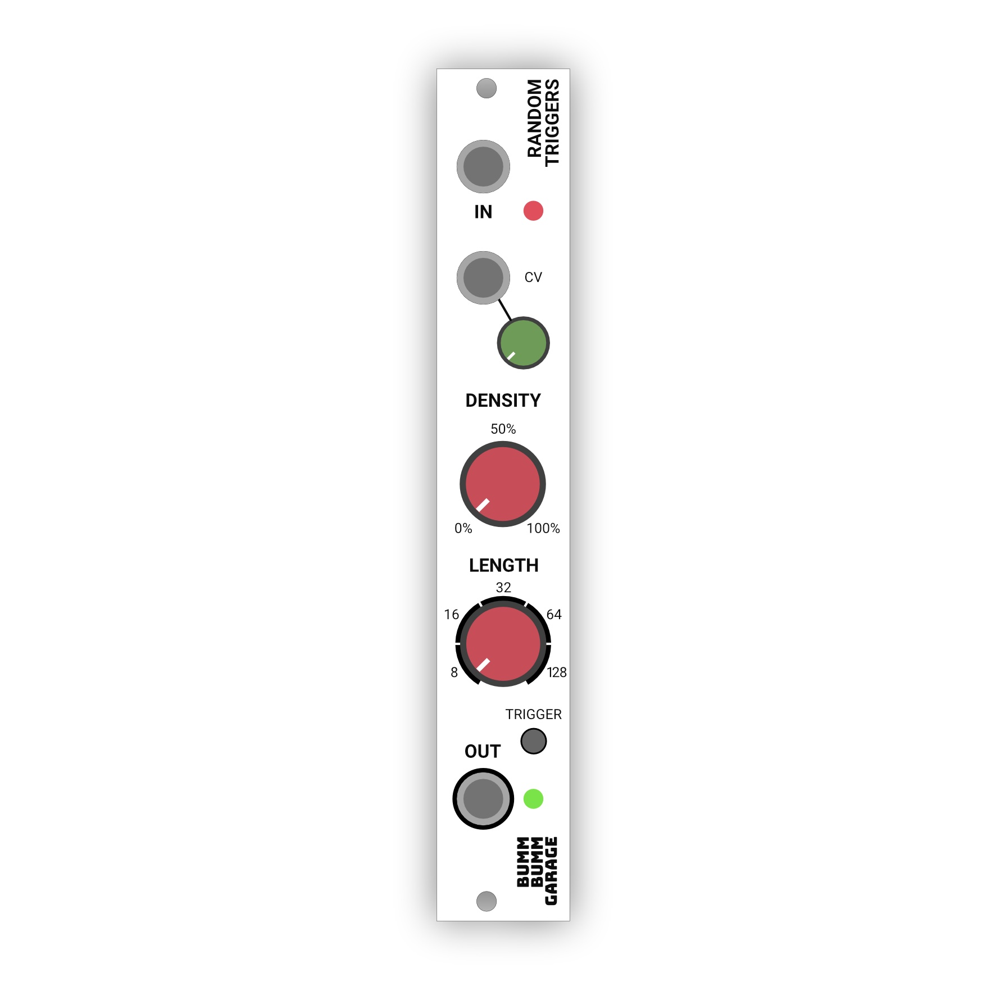

# Random Triggers

I wanted a that gives me a random sequence of triggers. So I hacked my [Clock Multiplier](/modules/clock-multiplier/) and programmed this Random Triggers module.

## Features

* ✅ **Variable density** defining the probability of triggers
* ✅ **Variable sequence length** from 8 to 128

## Resources

**Revision 1 (PCB prototype)**

* [Documentation of the Clock Multiplier](/modules/clock-multiplier/) as its platform
* [Arduino Sketch (Code)](https://github.com/bummbummgarage/bummbummgarage.github.io/blob/main/modules/random-triggers/Rev1/random-triggers/random-triggers.ino)
* Improvement potential: Adding functionality to the CV IN section and the manual trigger button.

