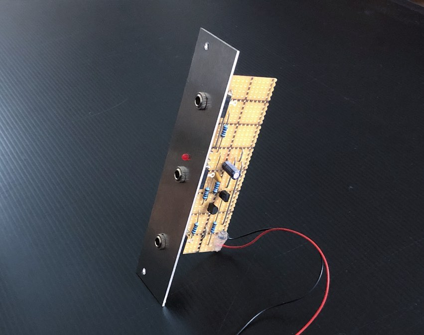
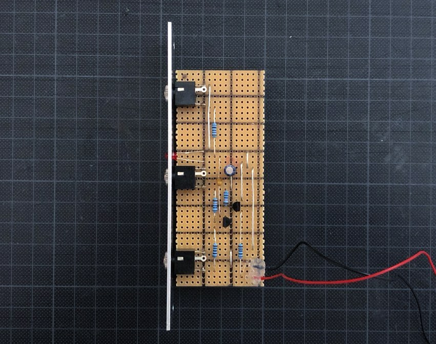
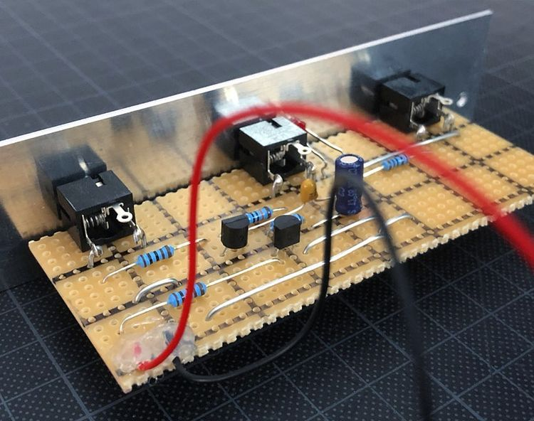

# VCA

*Version 0.1 from November 2020*

VCA that I built for my drum machine project. It's very simple and actually passive by its original design. I just added some illumination, so it requires power supply. 

The design is based on ["1 transistor passive VCA-ish thingy" by shiftr via muffwiggler.com](https://www.muffwiggler.com/forum/viewtopic.php?p=2346401&sid=5fdd862b174f20972d7108f0cdba0f51#p2346401).

## Details

## Links

* [Video Demo](Bumm Bumm Garage VCA 0.1 Video Demo 720p.mp4)
* [Schematic (PDF)](Bumm Bumm Garage VCA 0.1 Schematic.pdf)
* [Stripboard Layout (PDF)](Bumm Bumm Garage VCA 0.1 Stripboard Layout.pdf)
* [Front Panel (PDF)](Bumm Bumm Garage VCA 0.1 Panel.pdf)

## Improvement Potential

It doesn't seem to be 100%ly mature: First I can hear a high tones leaking through and second, it'll only work with positive voltages. But still enough for my requirements to synthesize a bass drum, a snare and a hi-hat 👍

Also see the comments on [Instagram](https://www.instagram.com/p/CHutyvEh7nR/) and [Reddit](https://www.reddit.com/r/synthdiy/comments/jwe0gb/very_simple_vca/).