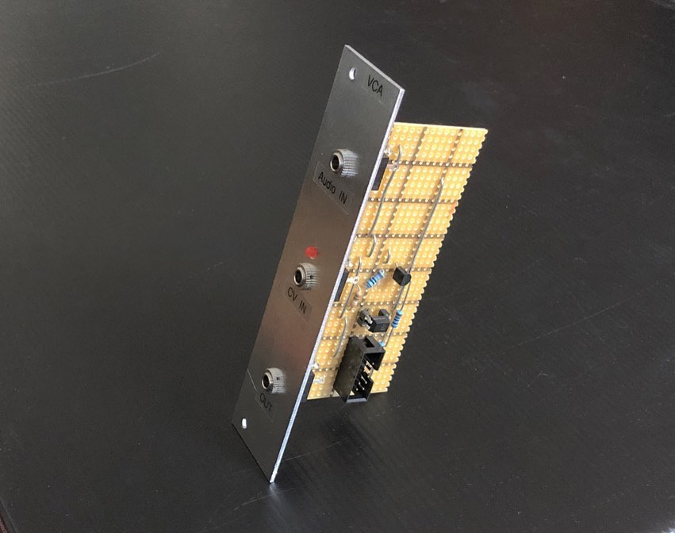
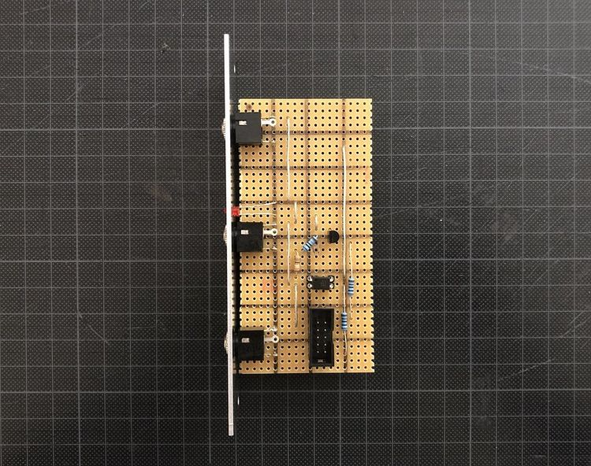
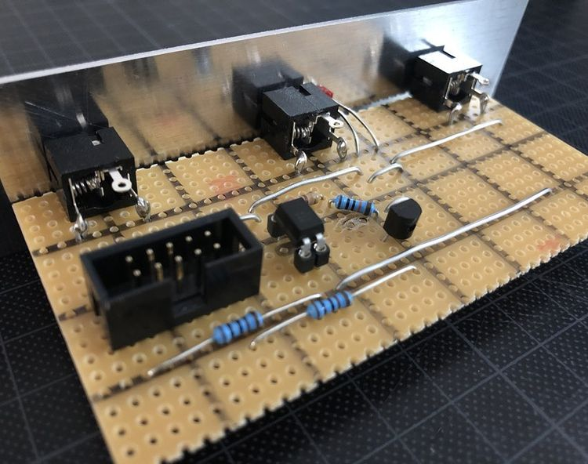

# VCA

*Version 0.2 from February 2021*

VCA that I built for my modular synth drum machine project. It's the second and simpliest VCA in my system. Deadly pure based on a single opto coupler (vactrol). The core is passive. I added a LED for the indication of the control voltage, so it needs power.

The design is based on ["Vactrol VCA" by Kristian Blåsol](https://www.dropbox.com/s/o6oiyanco8lzmvt/Schematic_Vactrol.pdf).

## Details

## Links

* [Video Demo](Bumm Bumm Garage VCA V0.2 Video Demo 640p.mp4)
* [Schematic (PDF)](Bumm Bumm Garage VCA V0.2 Schematic.pdf)
* [Stripboard Layout (PDF)](Bumm Bumm Garage VCA V0.2 Stripboard Layout.pdf)
* [Front Panel (PDF)](Bumm Bumm Garage VCA 0.2 Panel.pdf)

## Improvement Potential

There some distortion in the output. Furthermore the design doesn't work with negative voltages. Fortunately sufficient enough for the sounds of my drum machine project 👍🏻

Also see the comments on [Instagram](https://www.instagram.com/p/CLrdUU6Boba/) and [Reddit](https://www.reddit.com/r/synthdiy/comments/lreytp/simple_vca_in_eurorack_format_on_stripboard/).

