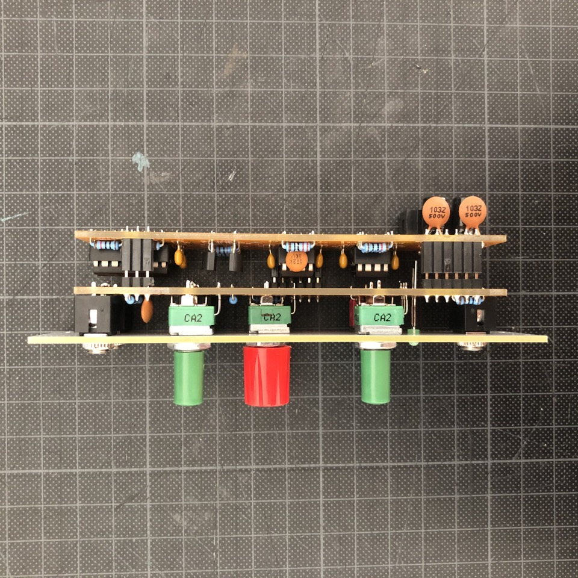

# VCF

Voltage controlled filter that I built for my techno rack. It's based on ["Korg late MS20 filter" by René Schmitz](https://www.schmitzbits.de/ms20.html).

René explains in the description how to add the high pass input. I didn't manage to make it a switch, so there are **two separate inputs for high pass and low pass** 🤷‍♂️

Then I accidentally found out that if I remove one of the diodes in the original design, the resonance gets a crunchy color (which I find particularly nice for bass voices). So I implemented this function with a switch: **Soft and hard resonance**.

## Assembly

**Right view on the module:**

**Panel and main board from top:**

**Control board and main board from bottom:**

You can find a detailed [step-by-step assembly on Imgur](https://imgur.com/gallery/KzbNrbc).

## Resources

**Revision 2 (breadboard prototype)**

* [Schematic (PDF)](Rev2/Bumm-Bumm-Garage-VCF-Rev2-Schematic.pdf)
* Showcase and feedback on [Instagram](https://www.instagram.com/p/CT4t3L1NxrV/) and [Reddit](https://www.reddit.com/r/synthdiy/comments/ppebad/vcf_lp_hp_ms20_inspired/)

**Revision 3 (two piece PCB)**

* [Video Demo](https://www.youtube.com/watch?v=bDhkRAk-1UY)
* [Schematic (PDF)](Rev3/Bumm-Bumm-Garage-VCF-Rev3-Schematic.pdf)
* [BOM (XLS)](Rev3/Bumm-Bumm-Garage-VCF-Rev3-BOM.xls)
* [Panel Gerber files (ZIP)](Rev3/Bumm-Bumm-Garage-VCF-Rev3-PCB-Gerber-Panel.zip)
* [Control board Gerber files (ZIP)](Rev3/Bumm-Bumm-Garage-VCF-Rev3-PCB-Gerber-Control_Board.zip)
* [Main board Gerber files (ZIP)](Rev3/Bumm-Bumm-Garage-VCF-Rev3-PCB-Gerber-Main_Board.zip)
* Showcase and feedback on [Instagram](https://www.instagram.com/p/CWIzVhPtUZS/)
* Improvement potential on [GitHub (issues)](https://github.com/bummbummgarage/bummbummgarage.github.io/issues?q=is%3Aissue+is%3Aopen+%5BVCF+Rev3%5D)

**Revision 4**

What's new? Optimized footprints, panel design and documentation.

* [Build Document (PDF)](Rev4/Bumm-Bumm-Garage-VCF-Rev4-Build_Doc.pdf)
* [BOM (XLS)](Rev4/Bumm-Bumm-Garage-VCF-Rev4-BOM.xls)
* [Schematic (PDF)](Rev4/Bumm-Bumm-Garage-VCF-Rev4-Schematic.pdf)
* Improvement potential on [GitHub (issues)](https://github.com/bummbummgarage/bummbummgarage.github.io/issues?q=is%3Aissue+is%3Aopen+%5BVCF+Rev4%5D)

**Revision 5**

What's new? Updated panel design and information on the PCB. It's the commercialized version available as a DYI kit at [Exploding Shed](https://www.exploding-shed.com/).

* [Build Document (PDF)](Rev5/Bumm-Bumm-Garage-VCF-Rev5-Build_Doc.pdf)
* Step-by-step assembly on [Imgur (images)](https://imgur.com/gallery/KzbNrbc)
