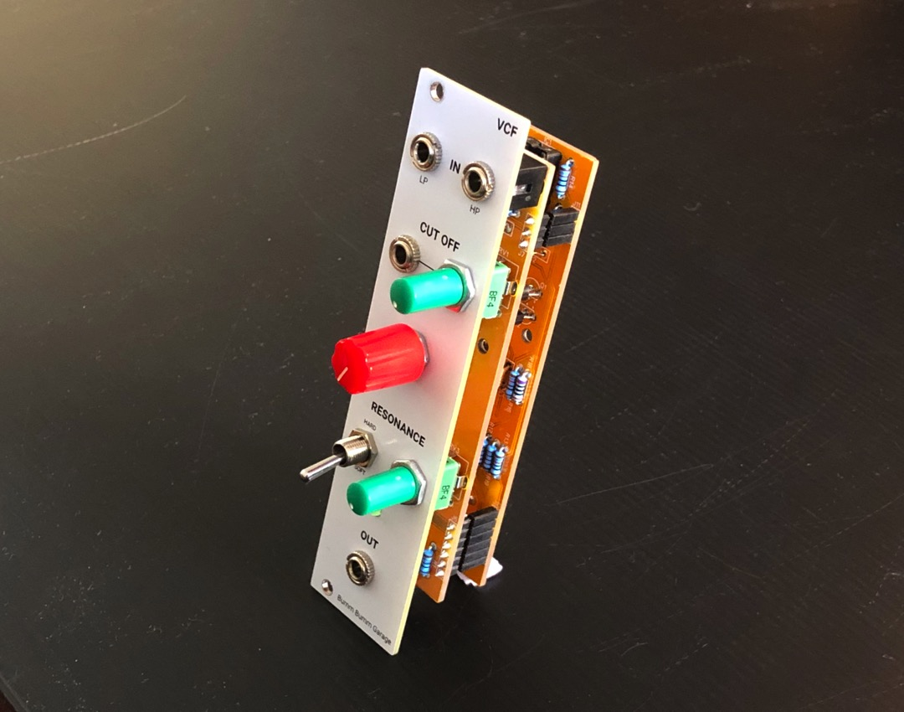
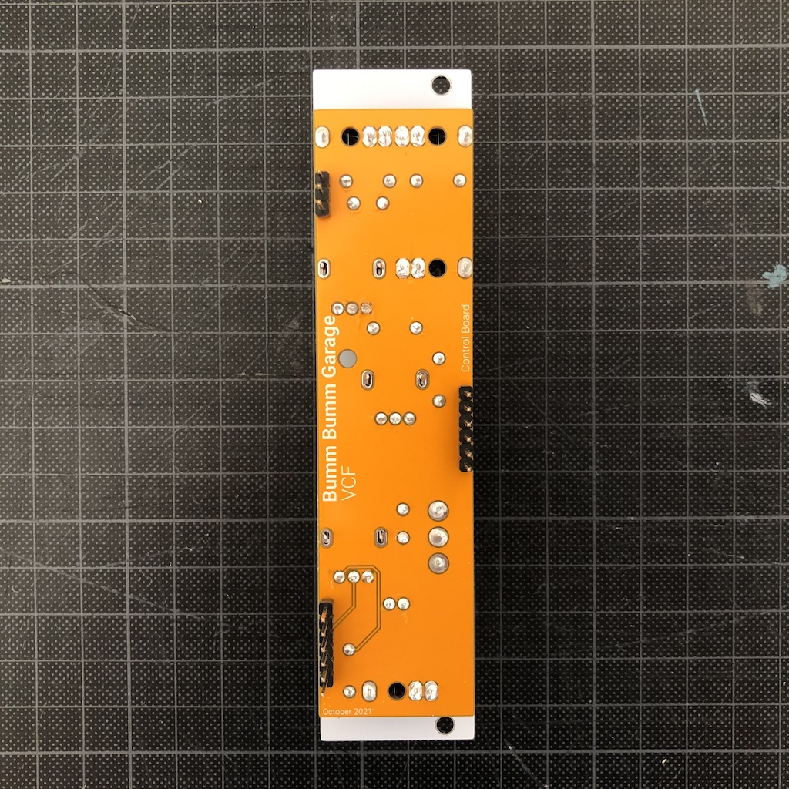
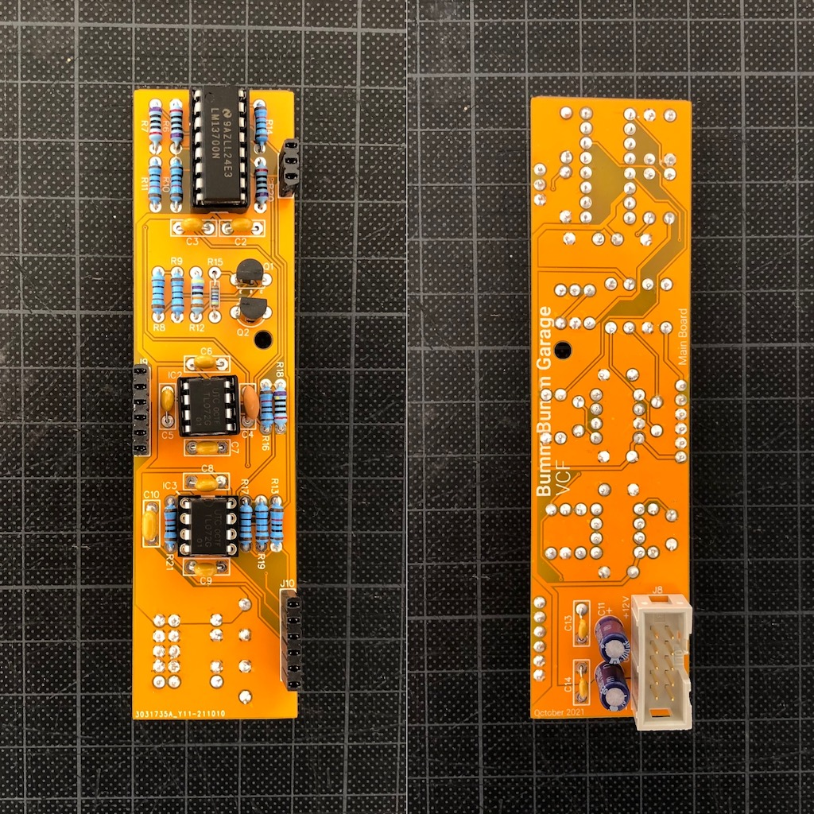

# VCF

Voltage controlled filter that I built for my techno rack. It's based on ["Korg late MS20 filter" by René Schmitz](https://www.schmitzbits.de/ms20.html).

René explains in the description how to add the high pass input. I didn't manage to make it a switch, so there are **two separate inputs for high pass and low pass** 🤷‍♂️

Then I accidentally found out that if I remove one of the diodes in the original design, the resonance gets a crunchy kick (which I find particularly nice for bass voices). So I implemented this function with a switch: **Soft and hard resonance**.

## Specifications

**Left and right view on the module:**

**Control board (bottom):**

**Main board (top and bottom):**

## Resources

**Revision 2 (breadboard prototype)**

* [Schematic (PDF)](Bumm-Bumm-Garage-VCF-Rev2-Schematic.pdf)
* Showcase and feedback on [Instagram](https://www.instagram.com/p/CT4t3L1NxrV/) and [Reddit](https://www.reddit.com/r/synthdiy/comments/ppebad/vcf_lp_hp_ms20_inspired/)

**Revision 3 (two piece PCB)**

* [Video Demo](https://www.youtube.com/watch?v=bDhkRAk-1UY)
* [Schematic (PDF)](Bumm-Bumm-Garage-VCF-Rev3-Schematic.pdf)
* [BOM (XLS)](Bumm-Bumm-Garage-VCF-Rev3-BOM.xls)
* [Panel Gerber files (ZIP)](Bumm-Bumm-Garage-VCF-Rev3-PCB-Gerber-Panel.zip)
* [Control board Gerber files (ZIP)](Bumm-Bumm-Garage-VCF-Rev3-PCB-Gerber-Control_Board.zip)
* [Main board Gerber files (ZIP)](Bumm-Bumm-Garage-VCF-Rev3-PCB-Gerber-Main_Board.zip)
* Showcase and feedback on [Instagram](https://www.instagram.com/p/CWIzVhPtUZS/)

## Improvement Potential

**Revision 3 (two piece PCB)**

* Via Instagram DM: "Also just a quick comment, your thonk jack footprints seem to have rather large solder pads, and it is very easy for solder to bridge from one to the other due to the very small gap, you might want to make the gap larger by making the pad slightly smaller"
* Via reddit: "Looking at the panel, I think this module would benefit from moving the Cutoff label down below the CV input. This would make it more clear that the large red knob is the cutoff control and the smaller green knob is the CV amount"

