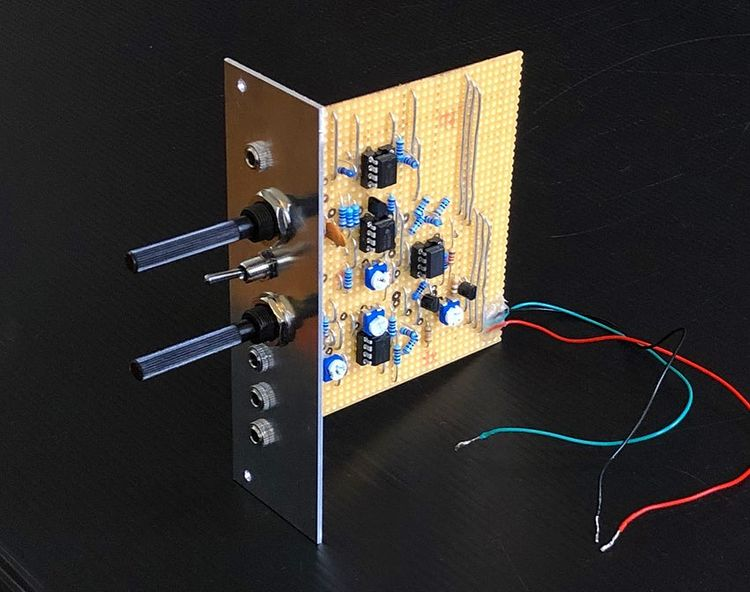
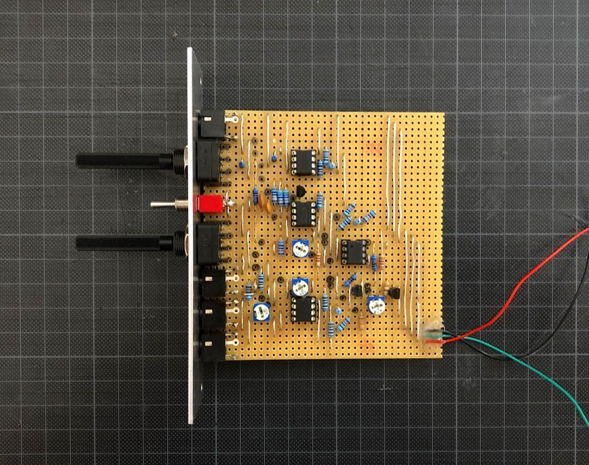
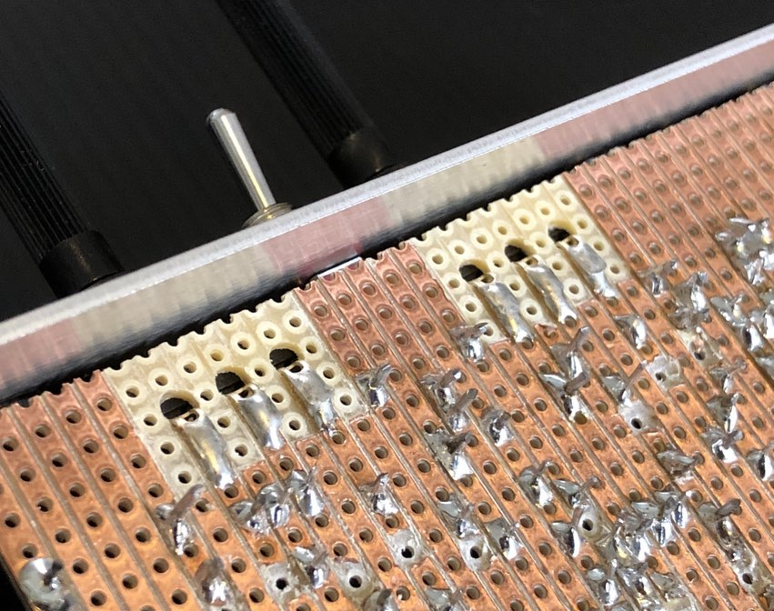

## VCO

*Version 0.4 from September 2020*

VCO that I pulled together for my drum machine project. It's based on a former standalone version and now migrated to Eurorack format since I decided to go into this direction.

### Features

✅ Square, triangle and sine wave

✅ Variable frequency range (30 Hz to 13 kHz)

✅ CV input with variable attenuation

✅ Variable DC

### Details

I found a thankful way to assemble the stripboard and the front panel by using the interface components, like the potis and audio jacks (Doepfer style).

### Links

* [Video Demo](Bumm Bumm Garage VCO 0.4 Video Demo 720p.mp4)
* [Schematic (PDF)](Bumm Bumm Garage VCO 0.4 Schematic.pdf) – Please don't mind that the circuitry index (e.g. "Input adjust") components index (e.g. "R3") start with numbers higher than 1. This due to the fact that I removed the integrated power supply unit from the former standalone version.
* [Stripboard Layout (PDF)](Bumm Bumm Garage VCO 0.4 Stripboard Layout.pdf)
* [Front Panel (PDF)](Bumm Bumm Garage VCO 0.4 Panel.pdf)
* [Feedback on Instagram](https://www.instagram.com/p/CFeNJiRBGOw/)
* [Feedback on Reddit](https://www.reddit.com/r/synthdiy/comments/iy6adt/eurorack_vco_square_triangle_sine_on_stripboard/)

