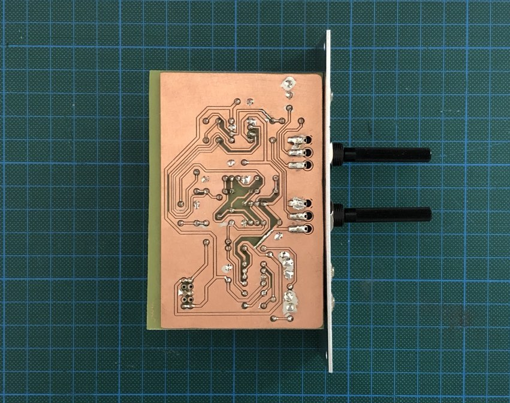

## VCO II

*Version 0.2.3 from March 2021*

VCO that I built for my modular synth drum machine project. It's based on two LM358 and one TL072, deadly simple.

### Features

✅ Square and triangle wave

✅ Frequency range from 0 Hz to 3.5 kHz

✅ FM input with variable attenuation

✅ Current: +17mA (+12V), -7 mA (-12V)

### Details

This is the third PCB that I etched in lifetime. First one went into trash, second one works but soldering was a battlefield and this one is sufficiently fine 💡

### Links

* [Video Demo](Bumm Bumm Garage VCO II 0.2.3 Video Demo 640p.mp4)
* [Schematic (PDF)](Bumm Bumm Garage VCO II 0.2.3 Schematic.pdf)
* [PCB Bottom Layer (PDF)](Bumm Bumm Garage VCO II 0.2.3 PCB Bottom Layer.pdf)
* [BOM (PDF)](Bumm Bumm Garage VCO II 0.2 BOM.pdf)
* [Front Panel (PDF)](Bumm Bumm Garage VCO II 0.2.3 Panel.pdf)
* [Feedback on Instagram](https://www.instagram.com/p/CMUoN5EBwTO/)
* [Feedback on Reddit](https://www.reddit.com/r/synthdiy/comments/m3j6je/simple_vco_in_eurorack_format_square_and_triangle/)

