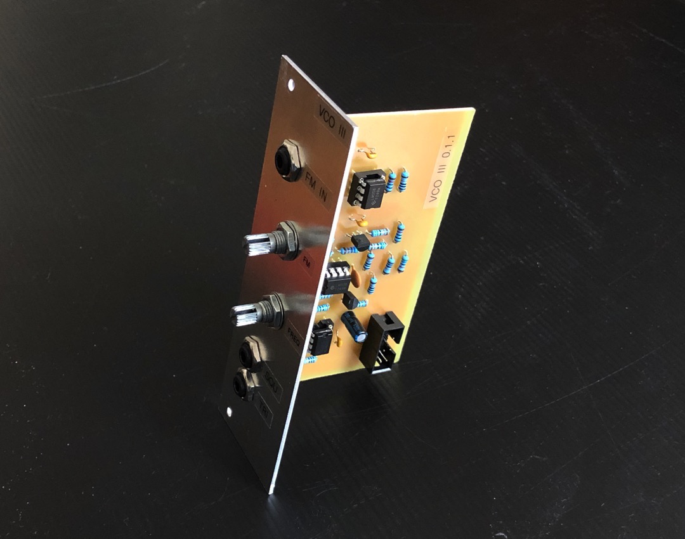
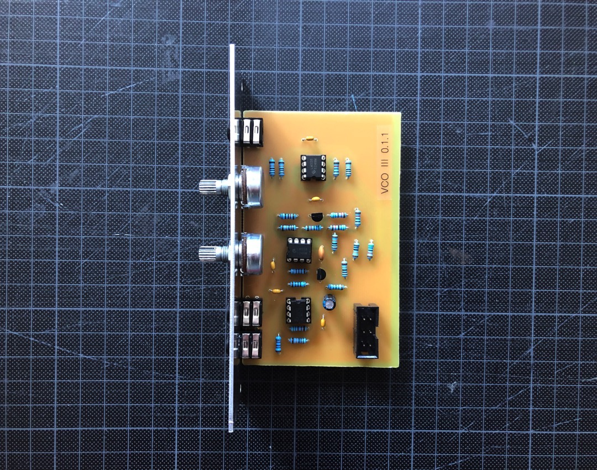
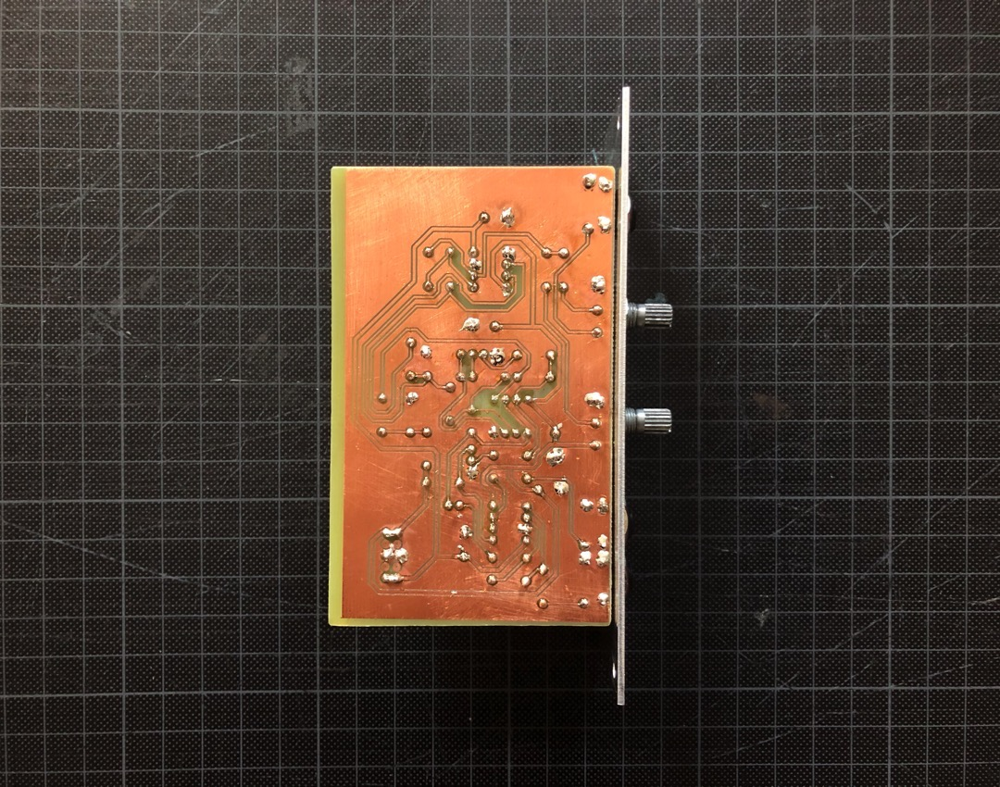
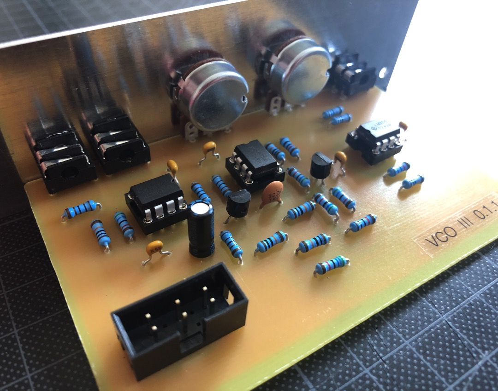

# VCO III

*Version 0.1.1 from March 2021*

VCO that I built for my modular synth drum machine project. It’s based on two LM358 and one TL072, deadly simple.

## Features

- ✅ Square and triangle wave
- ✅ Frequency range from 0 Hz to 3.5 kHz
- ✅ FM input with variable attenuation

## Details

This is the successor of VCO II 0.2.3. I added a NOT gate before the last output of the square wave. This way both waves are no longer out of phase. Also, the output of the square wave now has no DC bias at 0 Hz 👍🏻

The potis I use here are type WH148 and the jack sockets are from Cliff (FCR1281).

## Links

* [Video Demo](Bumm-Bumm-Garage-VCO-III-0.1.1-Video-Demo.mp4)
* [Schematic (PDF)](Bumm Bumm Garage VCO III 0.1 Schematic.pdf)
* [PCB Bottom Layer (PDF)](Bumm Bumm Garage VCO III 0.1.1 PCB Bottom Layer.pdf)
* [Front Panel (PDF)](Bumm Bumm Garage VCO III Panel.pdf)

## Improvement Potential

The solder pads at the pots and jack socket could be wider. And between the traces and the ground plane must have more space in between. I overlooked that when I made the plate – which took me around two hours to make it work in the etching bath 😅

Also see the comment on [Instagram](https://www.instagram.com/p/CM4tvzVBh62/) and [Reddit](https://www.reddit.com/r/synthdiy/comments/mdsjpf/simple_vco_in_eurorack_format_square_and_triangle/).

