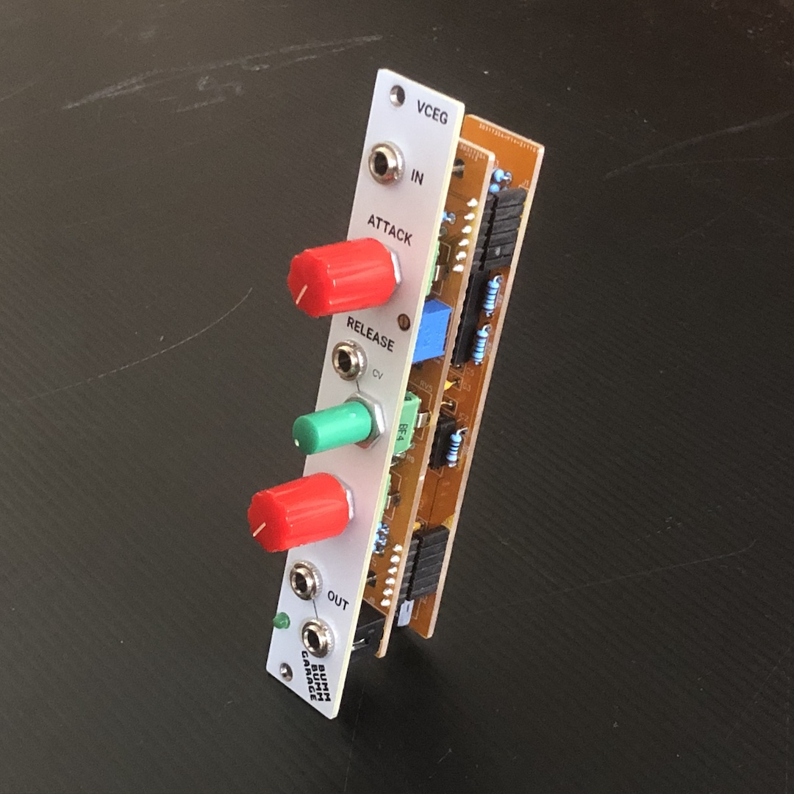
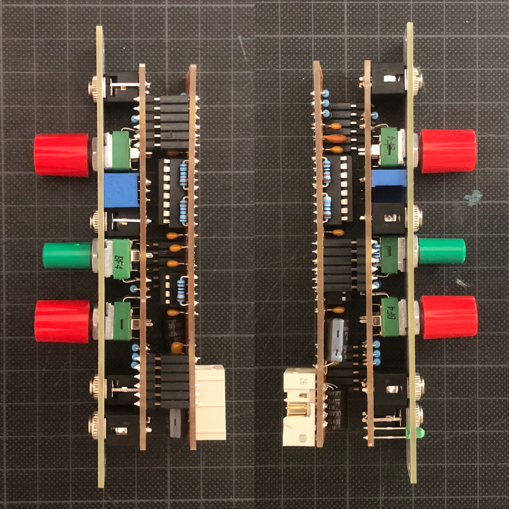
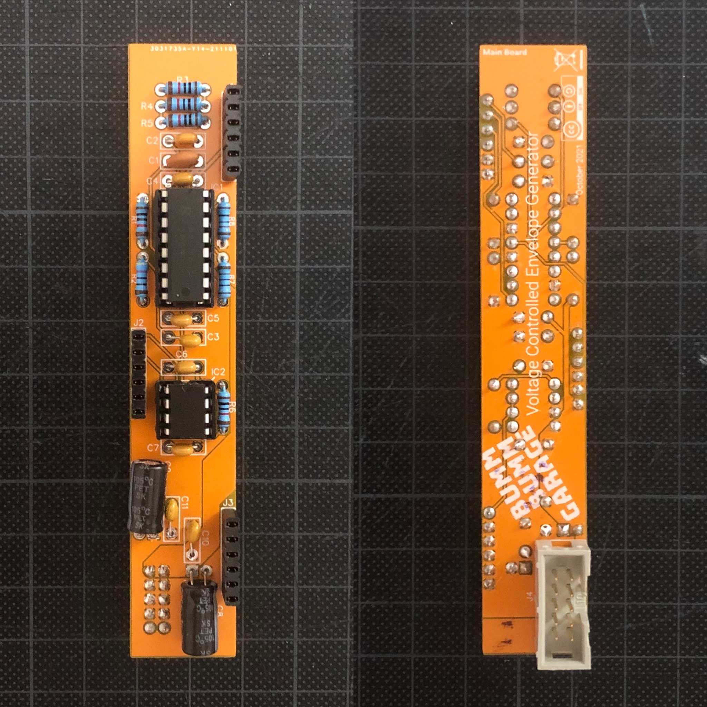

# Voltage Controlled Envelope Generator (VCEG)

Voltage Controlled Envelope Generator I built for my techno rack. In this context I mostly have fastly repeating trigger signals that just need some release to create the bass or lead tone.

If you're using attack to mute and unmute voices quickly, there's a little trimmer screw at the front to permanently set the minimum attack. This way you can avoid pops at the beginning of the tone when turning it on quickly.

There are two outputs on it, so you can control e.g. a VCA and a filter at the same time without having to multiply the signal.

The circuit of the module is very simple, because it's built around an [AS3310](https://www.alfarzpp.lv/eng/sc/AS3310.php) (envelope generator) chip that works gracefully clean.

## Features

- ✅ Attack & release
- ✅ Minimum attack by trimmer
- ✅ Voltage controlled release
- ✅ Eats both, gates and triggers
- ✅ 2 outputs

## Specifications

**Left and right view on the module:**

**Control board (bottom):**

**Main board (top and bottom):**

## Resources

**Revision 1 (breadboard prototype)**

* [Schematic (PDF)](REV-1/Bumm-Bumm-Garage-Voltage-Controlled-Envelope-Generator-REV-1-Schematic.pdf)
* Current draw: 17 mA +12V, 14 mA -12V
* Showcase and feedback on [Instagram](https://www.instagram.com/p/CVr-wQ2NpD9/) and [Reddit](https://www.reddit.com/r/synthdiy/comments/qjlsp3/diy_voltage_controlled_attack_release_eurorack/)

**Revision 2 (two piece PCB)**

* [Video Demo: Bass Lines](https://youtu.be/kLFvXCiCb9g)
* [Video Demo: Filter On Chords](https://www.youtube.com/watch?v=B0mmiwY81mQ)
* [Schematic (PDF)](REV-2/Bumm-Bumm-Garage-Voltage-Controlled-Envelope-Generator-REV-2-Schematic.pdf)
* [BOM (XLS)](REV-2/Bumm-Bumm-Garage-VCEG-Rev2-BOM.xls)
* [Panel Gerber files (ZIP)](REV-2/Bumm-Bumm-Garage-Voltage-Controlled-Envelope-Generator-REV-2-Gerber-Panel.zip)
* [Control board Gerber files (ZIP)](REV-2/Bumm-Bumm-Garage-Voltage-Controlled-Envelope-Generator-REV-2-Gerber-Control-Board.zip)
* [Main board Gerber files (ZIP)](REV-2/Bumm-Bumm-Garage-Voltage-Controlled-Envelope-Generator-REV-1-Gerber-Main-Board.zip)
* Showcase and feedback on [Instagram](https://www.instagram.com/p/CYDvkR_swXZ/) and [Reddit](https://www.reddit.com/r/synthdiy/comments/rr2led/voltage_controlled_envelope_generator_pcb/)

