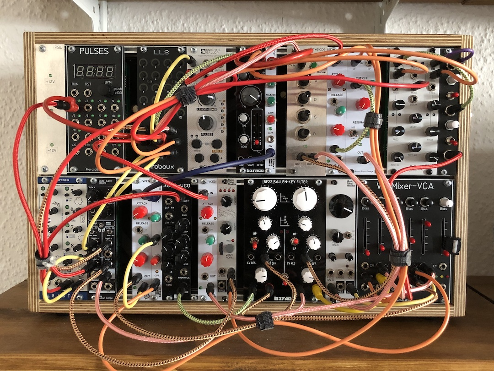

# A Modular Synth Techno Rack based on DIY Kits

**Clearly making techno!** That's how I got into the world of modular synthesizers. With [my DIY drum machine](/projects/diy-modular-synthesizer-drum-machine/) I have laid the foundations. Now I want to make music!

## Sound

This is the kind of music that I am envisioning:

* [Lady Starlight](https://www.youtube.com/watch?v=JXC-RGnLXOU)
* [Tunegirl](https://www.instagram.com/the_tunegirl/)
* [Karenn](https://www.youtube.com/watch?v=uVsfzprO7zs)
* [Amelie Lens](https://www.youtube.com/watch?v=GJkuTx1DQzg)
* [Layton Giordani](https://youtu.be/jYXeI_TGx9s?t=110)

## Setup

I'm creating **a mobile rack to play live**. And because I can (and because it's fun), I'm building it **based on DIY kits**.

According to the video "[How to make a TINY live techno modular synth in only 62HP](https://www.youtube.com/watch?v=4jCCzpWBsFs)" by Mylar Melodies, you need: **drums, bass, lead (e.g. chords) and freaky noises**.

Following that approach, I'm adding what is missing and replacing what needs to be improved. **Step by step**.

| Component                | Implementation                                               |
| ------------------------ | ------------------------------------------------------------ |
| ✅ Case and power supply  | [Case II 0.1](/modules/case-ii-0.1) [PSU & Distro Board 0.1](/modules/psu-distro-board-0.1/) |
| ✅ Clock & Divider        | [BPM Generator 20..2400 BPM with dividers](https://haraldswerk.de/Gate_and_Trigger/Pulses/Pulses.html) (Haralds:Werk) |
| ✅ Rhythm / beat patterns | [LL8](https://www.robaux.io/ll8) (Robaux) [Knight's Gallop](https://www.shakmatmodular.com/products/kg.html) (Shakmat Modular) |
| ✅ Kick drum              | [Kickall](https://www.befaco.org/kickall-2/) (Befaco)        |
| ✅ Snare / clap           | **Envelope generator**: [VCEG](/modules/voltage-controlled-envelope-generator-vceg/) **Noise**: From the [ADDAC215 Dual S&H+](https://www.addacsystem.com/en/products/modules/addac200-series/addac215) (ADDAC System) **Filter**: [BF-22](https://www.befaco.org/bf-22/) (Befaco) |
| ✅ Hats                   | **Voice**: [Hatz V2](http://patchingpanda.com/hatz) (Patching Panda) **Mixer**: [Mixer II](/modules/mixer-ii) |
| ✅ Sequencer              | [Popcorn v1.1](https://bastl-instruments.com/eurorack/modules/popcorn) (Bastl Instruments) |
| ✅ Sample and hold        | [ADDAC215 Dual S&H+](https://www.addacsystem.com/en/products/modules/addac200-series/addac215) (ADDAC System) |
| ✅ Bass                   | **Envelope generator**: [VCEG](/modules/voltage-controlled-envelope-generator-vceg/) **Voice**: [3080 VCO](https://www.tindie.com/products/pmfoundations/3080-vco-eurorack-pcb-set/) (PM Foundations) **Filter**: [BF-22](https://www.befaco.org/bf-22/) (Befaco) |
| ✅ Lead                   | **Envelope generator**: [VCEG](/modules/voltage-controlled-envelope-generator-vceg/) **Voice**: [Chord Organ](https://musicthing.co.uk/pages/chord.html) (Music Thing Modular) **Filter**: [VCF](/modules/vcf/) |
| ✅ Reverb                 | [Spring Reverb](https://musicthing.co.uk/pages/spring.html) (Music Thing Modular) |
| ✅ Mixer & VCAs           | [Voltage controlled Mixer-VCA](https://haraldswerk.de/Mixer/VC_Mixer_VCA/VC_Mixer_VCA.html) (Haralds:Werk) |

----

*Note: This setup is not carved in stone, but in a fluid state* 🌈

## Result

By the beginning of February 2022, I called the project finished 🎉 and happily started recording next level tracks.

